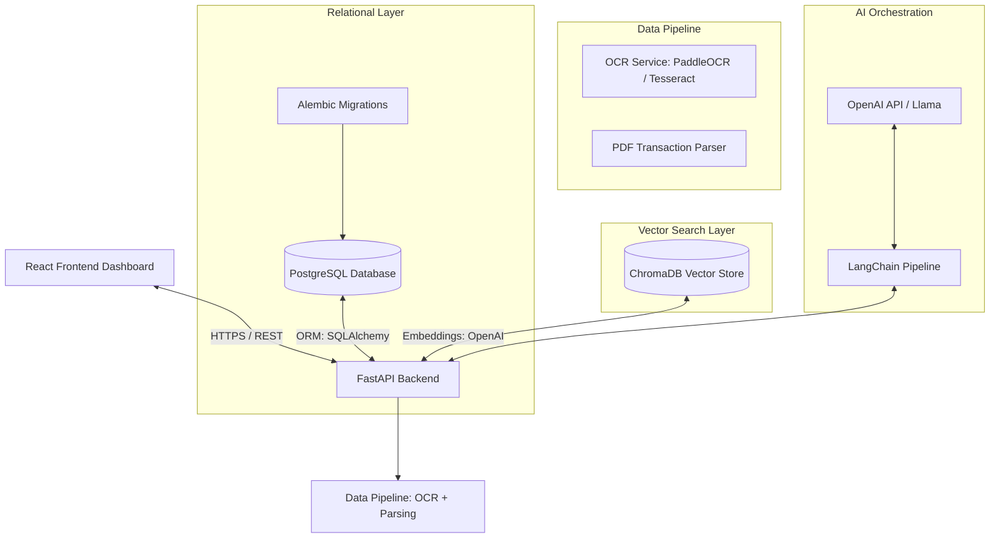

# AI-Powered Bank Statement Analysis System (Hybrid RAG)

A production-grade, enterprise-ready system built to parse, structure, index, and perform analytics over bank statement transactions. The application leverages a **Hybrid Retrieval-Augmented Generation (RAG)** architecture, combining structured SQL queries (via PostgreSQL) and semantic vector space queries (via ChromaDB) to deliver highly accurate answers to user prompts about financial statement contents.

---

## 🚀 Architectural Design & Strategy

### 1. High-Level System Architecture

The project is structured around a decoupled, service-oriented design:



*   **Ingestion Pipeline**: The user uploads bank statement PDFs. The system runs them through OCR and text parsers to extract structured tables (Date, Description, Amount, Balance, Category).
*   **Structured Storage (PostgreSQL)**: Transaction details are saved in PostgreSQL as relational records. This enables exact queries (e.g., "What was the total spent on gas in April 2026?").
*   **Unstructured Storage (ChromaDB)**: The text chunks of the statements (headers, disclaimers, fee schedules) are embedded and stored in ChromaDB, enabling semantic lookup.
*   **Hybrid RAG Router**: An orchestrator splits queries. Relational queries are translated to SQL; semantic queries are sent to vector search. Results are combined and sent to the LLM to formulate a response.

### 2. Why FastAPI Was Chosen
*   **Performance**: Built on Starlette and Uvicorn, FastAPI ranks among the fastest Python web frameworks, matching Go and NodeJS execution speeds.
*   **Asynchronous Native**: Supports `async`/`await` natively, which is critical when handling I/O bound operations like OCR processing, database writes, and LLM API calls.
*   **Type Safety & Validation**: Integrates with Pydantic for validation, preventing malformed payload writes and auto-generating accurate OpenAPI/Swagger documentation.

### 3. Why Docker From Day One
*   **Environment Parity**: Solves the "works on my machine" problem by aligning local developer environments, testing setups, and final production Kubernetes nodes.
*   **Dependency Management**: Simplifies setting up external dependencies such as PostgreSQL, ChromaDB, and complex system library bindings required by OCR engines.
*   **Isolated Scaling**: Allows scaling of CPU-intensive workloads (like PDF processing or OCR parsing) independently of the database or API routing threads.

### 4. How Future Modules Will Integrate
*   **Module 2 (Database Setup)**: SQLAlchemy ORM models will be placed in `backend/app/models/`, session settings in `backend/app/database/`, and migrations in `backend/alembic/`.
*   **Module 3 (OCR & Parsing)**: OCR scripts and text extractors will be implemented in `backend/app/services/ocr.py`.
*   **Module 4 (Vector DB & Embeddings)**: ChromaDB setups will be added to `backend/app/services/vector_store.py`.
*   **Module 5 (Hybrid RAG & LLM)**: LangChain orchestrators and router logic will be located in `backend/app/services/rag.py`.
*   **Module 6 (Frontend)**: A React/Vite dashboard will be built in the `frontend/` directory, referencing the FastAPI `/docs` specification.

---

## 📁 Folder Structure Explained

```text
bank-rag/
│
├── backend/                       # Backend Application Root
│   ├── app/                       # Core FastAPI application package
│   │   ├── api/                   # Router and endpoint definitions (v1, endpoints)
│   │   ├── core/                  # Core config, settings, and logging utilities
│   │   ├── database/              # SQLAlchemy engine initialization and session builders
│   │   ├── middleware/            # Custom FastAPI middlewares (CORS, execution timers)
│   │   ├── models/                # SQLAlchemy database model classes
│   │   ├── schemas/               # Pydantic validation schemas
│   │   ├── services/              # Business logic (OCR extraction, Embeddings, RAG)
│   │   ├── utils/                 # General utility scripts (parsers, sanitizers)
│   │   └── main.py                # Main application server loader
│   │
│   ├── tests/                     # Backend Unit/Integration tests
│   ├── Dockerfile                 # Docker build instruction file
│   └── requirements.txt           # Python dependency file
│
├── frontend/                      # React Frontend codebase
├── data/                          # Data files storage directory (untracked by Git)
│   ├── uploads/                   # Temporary folder for raw statement PDFs
│   ├── processed/                 # Extracted text outputs, normalized CSVs
│   └── embeddings/                # Local ChromaDB persistent vector blocks
│
├── docker/                        # Supplementary docker configs (init.sql scripts, etc.)
├── docs/                          # Architecture guides and API documentation
├── scripts/                       # Shell/Python maintenance and migration scripts
├── docker-compose.yml             # Local docker services compose orchestrator
├── .env                           # Environmental settings file containing secrets
├── .gitignore                     # Git track exclusions configuration
└── README.md                      # Developer manual
```

---

## ⚙️ Configuration Loading Workflow

```text
[.env File] ---> [python-dotenv / os.environ] ---> [Pydantic Settings] ---> [Application Components]
```

1. **Environmental Variables Configuration**: Developer specifies credentials (e.g. `POSTGRES_PASSWORD`, `OPENAI_API_KEY`) inside `.env` at the root directory.
2. **dotenv Parsing**: At launch, `backend/app/core/config.py` searches for `.env` files in the runtime workspace or parent paths.
3. **Pydantic Validation**: `BaseSettings` parses values, casts data types (e.g. `POSTGRES_PORT` string is converted to an `int`), sets defaults if absent, and instantiates a read-only `settings` object.
4. **Application Import**: API and database services import `settings` to fetch validated runtime configuration parameters.

---

## 🪵 Centralized Logging Strategy

*   **Dual Log Writing**: Standardizes log output by sending entries to:
    1. **Console (sys.stdout)**: Instantly visible in container orchestrators (e.g. Docker logs, Kubernetes stdout).
    2. **Rotating File File**: Saved to `backend/logs/app.log`. Includes a `RotatingFileHandler` with a limit of 10MB per file and a backup count of 5 files to prevent system disk space issues.
*   **Format**: `[Timestamp] [Level] [Logger Name] [File:Line] - Message`. E.g.:
    `[2026-06-07 21:45:00] INFO     app.main [main.py:12] - Starting up FastAPI application...`
*   **Filtering**: Third-party packages (like `uvicorn` and HTTP libraries) are set to higher severity levels to avoid spamming the log files.

---

## 🐳 Running Under Docker

### 1. Prerequisites
Ensure you have Docker and Docker Compose installed.

### 2. Startup Command
Start the backend container in detached (background) mode:
```bash
docker compose up --build -d
```

### 3. Volume Mounting & Hot Reloading
The `docker-compose.yml` mounts the host's `./backend/app` directory to the container's `/app/app`.
*   **Why**: This maps local code modifications directly into the running container.
*   **Result**: Combined with Uvicorn's watch functionality, editing code locally triggers an automatic reload inside the container, giving you a smooth development experience without rebuilding the image.

---

## 🛠️ Local Running (Without Docker)

1. **Prepare Environment**:
   ```bash
   cd backend
   python -m venv venv
   
   # Activate:
   # On Windows:
   .\venv\Scripts\Activate.ps1
   # On Linux/macOS:
   source venv/bin/activate
   ```
2. **Install Dependencies**:
   ```bash
   pip install -r requirements.txt
   ```
3. **Run Application**:
   ```bash
   uvicorn app.main:app --reload
   ```

---

## 🧪 Testing & Verification

### Verification endpoints:
1. **Root**: `GET /`
2. **Health**: `GET /health`

### Testing Commands:

**Locally (via PowerShell/cmd):**
```powershell
# Using Python standard libraries to query
python -c "import urllib.request; print(urllib.request.urlopen('http://localhost:8000/health').read().decode())"
```

**Docker Context (via Curl):**
```bash
docker compose exec backend curl -s http://localhost:8000/health
```

**Expected JSON response from `/health`:**
```json
{
  "status": "healthy",
  "version": "1.0.0",
  "dependencies": {
    "postgresql": "pending_setup",
    "chromadb": "pending_setup",
    "openai_api": "configured"
  }
}
```
