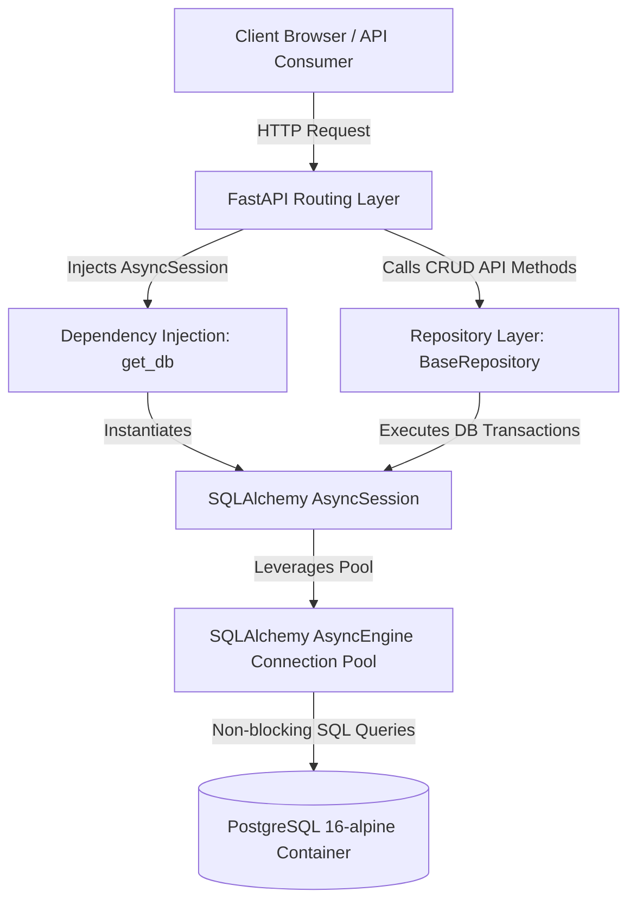
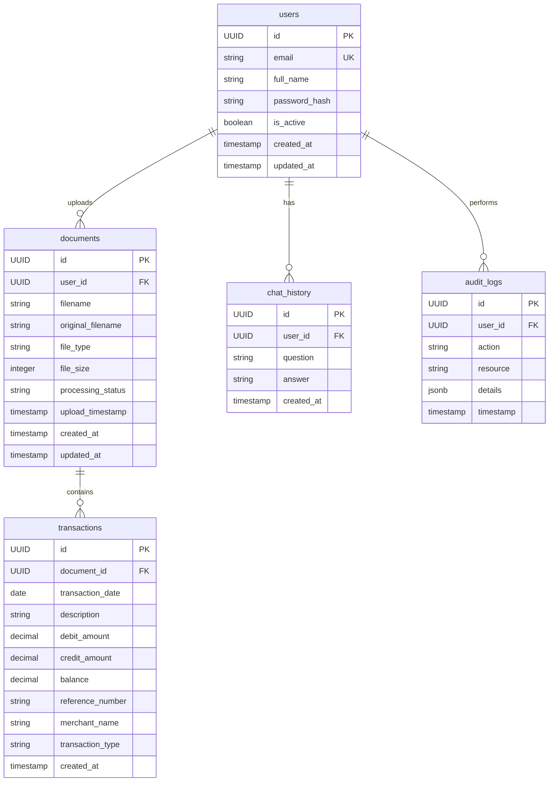
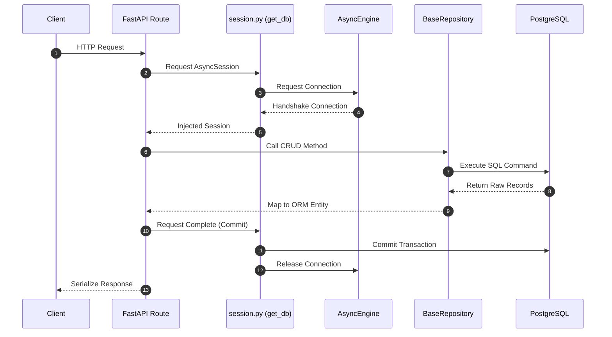

# Module 2 Technical Report: Database Foundation

---

## 1. Module Overview

### Metadata
*   **Module Name**: Database Foundation
*   **Module Version**: 1.0.0
*   **Development Status**: Completed & Verified
*   **Author**: Principal Software Architect & DevOps Lead
*   **Last Updated**: June 7, 2026
*   **Dependencies**: SQLAlchemy 2.x, Alembic, asyncpg, PostgreSQL 16
*   **Related Modules**: Module 1 (Project Setup & Environment), Module 3 (OCR & Transaction Extraction), Module 4 (Vector DB & Hybrid RAG)

### Explanation
#### What this module does
This module builds the database architecture and persistence foundation for the system. It provisions a PostgreSQL 16 container, configures SQLAlchemy 2.0 as the Object-Relational Mapper (ORM) using asynchronous execution, sets up Alembic for tracking schema migrations, designs the database entities (users, documents, transactions, chat histories, audit logs), and implements the Repository Pattern to isolate database operations from FastAPI endpoints.

#### Why this module exists
Enterprise financial systems require high concurrency, database consistency, auditability, and structured query speeds. This module establishes an asynchronous database pool, type-safe database query isolation (via Repositories), and structured schema models to handle high volumes of transaction data.

#### Business Purpose
1.  **Auditable Data Store**: Maintain a secure record of user activities, uploaded financial statements, and generated answers.
2.  **Transaction Integrity**: Guarantee strict ACID compliance during statements processing, ensuring transactions are fully captured or rolled back if parsing fails.
3.  **Customer Identity Isolation**: Safely partition documents and statements data on a per-user basis.

#### Technical Purpose
1.  **Asynchronous Concurrency**: Allow FastAPI to handle hundreds of concurrent requests without blocking execution threads during database queries.
2.  **Schema Governance**: Guarantee that database schemas can be evolved incrementally across local, staging, and production environments using migration version control.
3.  **Logical Abstraction**: Cleanly isolate the database schema modeling layer from route handling and business logic layers.

#### Problems Solved
*   **Connection Exhaustion**: Resolved by configuring the SQLAlchemy asynchronous connection pool.
*   **Slow Data Retrievals**: Solved by implementing database-level indexes on frequently queried fields like `merchant_name` and `transaction_date`.
*   **Schema Drift**: Solved by using Alembic migrations to synchronize development database instances.

---

## 2. Module Architecture

The high-level architecture of Module 2 utilizes a layered design pattern:



### Data Flow
1.  **Request Initiation**: Client sends a request to the FastAPI application.
2.  **Dependency Resolution**: FastAPI resolves the `get_db` dependency, opening an asynchronous transaction session from the connection pool.
3.  **Repository Handlers**: The API route hands the session to a repository instance.
4.  **SQL Execution**: The repository uses SQLAlchemy Core/ORM to build async SQL commands.
5.  **Driver Communication**: The `asyncpg` driver converts commands to binary wire protocols, communicating with the PostgreSQL database.
6.  **Results Unification**: Results are mapped to SQLAlchemy models, Pydantic schemas serialize the response, and the connection returns to the connection pool.

---

## 3. Folder Structure Analysis

```
backend/
├── alembic/
│   ├── versions/
│   ├── env.py
│   ├── README
│   └── script.py.mako
├── alembic.ini
├── app/
│   ├── core/
│   │   └── config.py
│   ├── database/
│   │   ├── __init__.py
│   │   └── session.py
│   ├── models/
│   │   ├── __init__.py
│   │   ├── audit.py
│   │   ├── base.py
│   │   ├── chat.py
│   │   ├── document.py
│   │   ├── transaction.py
│   │   └── user.py
│   └── repositories/
│       ├── __init__.py
│       └── base.py
└── tests/
    ├── conftest.py
    └── test_db.py
```

### `backend/alembic/`
*   **Purpose**: Stores version-controlled schema migration scripts.
*   **Responsibilities**: Manages database upgrades and downgrades, tracks schema changes, and configures migration connections.
*   **Example files**: `env.py` (orchestrates migration connections), `script.py.mako` (migration code template).
*   **Best practices**: Keeps schema code changes decoupled from the deployment cycle.

### `backend/app/database/`
*   **Purpose**: Manages connections, pools, and sessions.
*   **Responsibilities**: Instantiates the `AsyncEngine` and provides session generators to FastAPI routes.
*   **Example files**: `session.py` (manages the SQLAlchemy engine).

### `backend/app/models/`
*   **Purpose**: Defines database tables as Python classes.
*   **Responsibilities**: Defines column names, datatypes, indices, relationships, and foreign keys.
*   **Example files**: `user.py`, `document.py`, `transaction.py`.

### `backend/app/repositories/`
*   **Purpose**: Houses data access operations.
*   **Responsibilities**: Provides common CRUD operations (Create, Read, Update, Delete) to decouple SQL query logic from API routes.
*   **Example files**: `base.py` (generic base class).

---

## 4. File-by-File Explanation

### [backend/app/core/config.py](file:///d:/Project/bank-rag/backend/app/core/config.py)
*   **Purpose**: Contains configuration settings for the backend.
*   **Responsibilities**: Loads env files and validates configurations.
*   **Key Properties**:
    *   `database_url`: Synced URL for Alembic.
    *   `async_database_url`: Async URL for the FastAPI app.
*   **Relationships**: Imported by `session.py`, `env.py`, and `main.py`.

### [backend/app/database/session.py](file:///d:/Project/bank-rag/backend/app/database/session.py)
*   **Purpose**: Connects the app to PostgreSQL.
*   **Responsibilities**: Creates the async engine, session makers, and request session handlers.
*   **Key Functions**:
    *   `get_db()`: Asynchronous database session generator that commits or rolls back transactions automatically.
*   **Relationships**: Used by API routes for database access.

### [backend/app/models/base.py](file:///d:/Project/bank-rag/backend/app/models/base.py)
*   **Purpose**: Defines the base class for ORM models.
*   **Responsibilities**: Adds default columns (`id`, `created_at`, `updated_at`) to inheriting models.
*   **Key Classes**:
    *   `Base`: SQLAlchemy DeclarativeBase.
    *   `BaseModel`: Mixin class providing UUIDs and UTC timestamps.

### [backend/app/models/user.py](file:///d:/Project/bank-rag/backend/app/models/user.py)
*   **Purpose**: Models user accounts.
*   **Responsibilities**: Stores emails, full names, password hashes, and handles cascade deletion of user records.

### [backend/app/models/document.py](file:///d:/Project/bank-rag/backend/app/models/document.py)
*   **Purpose**: Models uploaded files.
*   **Responsibilities**: Tracks processing status (pending, processing, completed, failed) and file sizes.

### [backend/app/models/transaction.py](file:///d:/Project/bank-rag/backend/app/models/transaction.py)
*   **Purpose**: Models individual statement transactions.
*   **Responsibilities**: Stores dates, credit/debit amounts, merchant names, and balances. Uses database indexes on `merchant_name` and `transaction_date` for efficient search.

### [backend/app/models/chat.py](file:///d:/Project/bank-rag/backend/app/models/chat.py)
*   **Purpose**: Models user chat history.
*   **Responsibilities**: Saves questions and answers for conversational context.

### [backend/app/models/audit.py](file:///d:/Project/bank-rag/backend/app/models/audit.py)
*   **Purpose**: Models audit logs.
*   **Responsibilities**: Tracks user actions and uses PostgreSQL JSONB for flexible metadata storage.

### [backend/app/repositories/base.py](file:///d:/Project/bank-rag/backend/app/repositories/base.py)
*   **Purpose**: Implements the Repository Pattern.
*   **Responsibilities**: Provides generic async CRUD methods (`get_by_id`, `get_all`, `create`, `update`, `delete`).

### [backend/alembic/env.py](file:///d:/Project/bank-rag/backend/alembic/env.py)
*   **Purpose**: Configures Alembic migration environments.
*   **Responsibilities**: Resolves connection strings and applies migrations asynchronously.

### [backend/tests/conftest.py](file:///d:/Project/bank-rag/backend/tests/conftest.py)
*   **Purpose**: Defines test fixtures.
*   **Responsibilities**: Automatically creates and tears down test schemas. Provides isolated rollback sessions for tests.

### [backend/tests/test_db.py](file:///d:/Project/bank-rag/backend/tests/test_db.py)
*   **Purpose**: Tests database components.
*   **Responsibilities**: Runs validation checks for database connectivity, CRUD operations, and relational integrity.

---

## 5. Technology Stack Analysis

### PostgreSQL
*   **What**: Object-relational database management system.
*   **Why**: Selected for its support for UUIDs, JSONB, indexing options, and transaction safety.
*   **Benefits**: Handles large transaction volumes and offers seamless JSON query integrations.
*   **Alternatives**: MySQL, MariaDB, SQLite.
*   **Industry Usage**: Standard database choice for microservices, financial platforms, and web services.

### SQLAlchemy 2.0
*   **What**: Python SQL Toolkit and Object-Relational Mapper.
*   **Why**: Used to interact with database tables via Python classes.
*   **Benefits**: Type safety, support for async engines, and protection against SQL injection.
*   **Alternatives**: TortoiseORM, SQLModel, Prisma Client Python.
*   **Industry Usage**: The primary ORM used in Python backend services.

### Alembic
*   **What**: Database migration tool for SQLAlchemy.
*   **Why**: Used to track and apply schema updates.
*   **Benefits**: Autogenerates migrations by comparing models with database states.
*   **Alternatives**: Yoyo Migrations, Flyway.
*   **Industry Usage**: Standard companion migration tool for SQLAlchemy projects.

### Docker & Docker Compose
*   **What**: Container orchestration tool.
*   **Why**: Standardizes environments across local and production setups.
*   **Benefits**: Eliminates "it works on my machine" issues and isolates services.
*   **Alternatives**: Podman, Kubernetes.
*   **Industry Usage**: Industry standard for containerizing and deploying backend services.

---

## 6. Dependency Analysis

### `sqlalchemy>=2.0.35`
*   **Purpose**: High-level ORM database connectivity.
*   **Features Used**: Declarative mapping, relationship definitions, connection pooling, and asynchronous queries.
*   **Benefits**: Type hints, SQL injection protection, and native async support.

### `alembic>=1.13.3`
*   **Purpose**: Database schema migrations.
*   **Features Used**: Autogenerated migrations and migration version history.
*   **Benefits**: Ensures schema consistency across environments.

### `asyncpg>=0.30.0`
*   **Purpose**: Asynchronous PostgreSQL driver.
*   **Features Used**: Async connection protocol.
*   **Benefits**: Provides fast, non-blocking performance on PostgreSQL.

### `pytest-asyncio>=0.24.0`
*   **Purpose**: Testing suite utility.
*   **Features Used**: Async test case runner.
*   **Benefits**: Runs asynchronous pytest test cases.

---

## 7. Command Reference Guide

### Run migrations
```bash
.\venv\Scripts\alembic upgrade head
```
*   **Purpose**: Applies pending database migrations.
*   **Breakdown**:
    *   `alembic`: Migration tool CLI.
    *   `upgrade`: Action command.
    *   `head`: Target version.
*   **Expected Output**: Runs pending migrations and outputs target revision IDs.

### Autogenerate migration scripts
```bash
.\venv\Scripts\alembic revision --autogenerate -m "Migration description"
```
*   **Purpose**: Creates a new migration script based on model changes.
*   **Expected Output**: A migration script generated in `backend/alembic/versions/`.

### Run tests
```bash
.\venv\Scripts\pytest
```
*   **Purpose**: Executes the project's test suite.
*   **Expected Output**: Runs tests and outputs pass/fail summaries.

### Spin up PostgreSQL
```bash
docker compose up -d postgres
```
*   **Purpose**: Starts the PostgreSQL database container.
*   **Expected Output**: Downloads postgres images if needed, runs the container in detached mode, and prints container status.

---

## 8. Configuration Files

### [docker-compose.yml](file:///d:/Project/bank-rag/docker-compose.yml)
*   **Purpose**: Defines services in the application container network.
*   **Important Settings**:
    *   `postgres`: Configuration for the database container.
    *   `postgres_data`: Persistent volume for database storage.
*   **Impact**: Integrates application services with health checks.

### [backend/alembic.ini](file:///d:/Project/bank-rag/backend/alembic.ini)
*   **Purpose**: Configures Alembic migration runtimes.
*   **Important Settings**:
    *   `script_location`: Relative path to migration scripts.
*   **Impact**: Controls how database migrations connect to targets.

### [.env](file:///d:/Project/bank-rag/.env)
*   **Purpose**: Central repository for configuration variables.
*   **Important Settings**:
    *   `POSTGRES_USER`: Database user.
    *   `POSTGRES_PASSWORD`: Database password.
    *   `POSTGRES_HOST`: Configured as `localhost` for local runs, overridden to `postgres` in container environments.
*   **Impact**: Centralized setting configuration.

---

## 9. API Documentation

### `GET /health`
*   **Method**: `GET`
*   **Purpose**: Returns application health status.
*   **Response**:
    ```json
    {
      "status": "healthy",
      "version": "1.0.0",
      "dependencies": {
        "postgresql": "healthy",
        "chromadb": "pending_setup",
        "openai_api": "configured"
      }
    }
    ```

### `GET /health/db`
*   **Method**: `GET`
*   **Purpose**: Performs database connection check.
*   **Response**:
    ```json
    {
      "status": "healthy",
      "database": "postgresql",
      "message": "Database connection verified successfully"
    }
    ```

---

## 10. Database Design



### Tables
*   **`users`**: Contains account credentials and profile settings.
*   **`documents`**: Tracks user statement uploads.
*   **`transactions`**: Stores financial records extracted from statements.
*   **`chat_history`**: Logs conversation interactions.
*   **`audit_logs`**: Retains user activity records. Uses `JSONB` for details to support unstructured event metadata.

---

## 11. Business Logic Explanation

### User cascade deletion
*   **Purpose**: Cleans up user data on account deletion.
*   **Processing**: Uses SQLAlchemy `cascade="all, delete-orphan"` to delete associated records.
*   **Details**: Deleting a user deletes their documents, transactions, and chat logs. User reference in audit logs is set to `NULL` for compliance records.

### Transaction Isolation
*   **Purpose**: Ensures statement uploads are fully completed or cleanly rolled back.
*   **Processing**: Commits transactions only on request completion; exceptions trigger automatic rollback.

---

## 12. Execution Flow



---

## 13. Security Analysis

### Input Sanitization
SQLAlchemy handles parameter binding, which prevents SQL injection vulnerabilities.

### Secure Identifiers
Uses UUIDv4 instead of auto-incrementing integers, preventing enumeration attacks on resources.

### Secure Configurations
Database credentials are loaded from environment variables rather than being hardcoded in codebases.

---

## 14. Logging & Monitoring

*   **Database Logs**: Connection engine events are printed in development configurations.
*   **App Logs**: Errors are captured by the app logging framework.
*   **Database Check**: `/health/db` endpoint enables container monitoring.

---

## 15. Error Handling

### Database Connection Loss
*   **Detection**: Connection attempts throw an operational exception.
*   **Handling**: FastAPI loggers record the error, rollback transaction sessions, and release active connections.
*   **Response**: Returns an HTTP 500 error code with a clean error message.

---

## 16. Testing Strategy

*   **Approach**: Run tests inside isolated transactions that are rolled back after each test runs.
*   **Fixtures**:
    *   `db_engine`: Creates and drops test database tables.
    *   `db_session`: Returns an active connection wrapped in a rollback transaction.
*   **Test coverage**: Validates database connections, repository CRUD operations, and cascade deletions.

---

## 17. Deployment Guide

### Local Development Setup
1. Clone the repository and configure settings in `.env`.
2. Start the database container:
    ```bash
    docker compose up -d postgres
    ```
3. Run Alembic migrations:
    ```bash
    .\venv\Scripts\alembic upgrade head
    ```
4. Start the backend application:
    ```bash
    .\venv\Scripts\uvicorn app.main:app --reload
    ```

---

## 18. Performance Considerations

*   **Async execution**: Frees thread processing during database operations.
*   **Connection pooling**: Reduces the overhead of establishing database connections.
*   **Database indexes**: Indexes on fields like `merchant_name` optimize search speeds.
*   **Data Types**: Uses `JSONB` for unstructured fields like audit log details.

---

## 19. Module Integration

*   **Integration with Module 1**: Uses configuration variables defined in Module 1.
*   **Integration with Module 3**: Module 3 uses these models to persist parsed statements and transactions.
*   **Integration with Module 4**: Module 4 queries database transactions to combine with vector search.

---

## 20. Learning Section

### Key Concepts

#### Object-Relational Mapping (ORM)
Maps relational database tables to Python classes, allowing you to interact with the database using object-oriented code.

#### Repository Pattern
Decouples data access logic from route handlers, making the codebase easier to maintain and test.

#### Asynchronous Operations
Enables applications to perform database requests without blocking other concurrent operations, improving performance.

### Common Interview Questions

#### 1. Why use async ORMs in FastAPI instead of standard sync ORMs?
FastAPI handles requests asynchronously. Sync database requests block request handling threads, whereas async requests allow other operations to proceed while waiting for the database to respond.

#### 2. What is the difference between Lazy Loading and Eager Loading in async contexts?
Lazy loading loads related data only when it is accessed, which can cause issues in async contexts if lazy loading is not explicitly supported. Eager loading retrieves related data upfront in a single query.

---

## 21. Troubleshooting Guide

### Issue: `MissingGreenlet` error when accessing relations
*   **Root Cause**: Attempting to lazy-load related data in an async context.
*   **Solution**: Use `selectinload` or `joinedload` to eagerly load relationships in your query:
    ```python
    select(User).options(selectinload(User.documents))
    ```

### Issue: Postgres connection failures
*   **Root Cause**: Incorrect host configuration.
*   **Solution**: Set `POSTGRES_HOST=localhost` for local environments and `POSTGRES_HOST=postgres` inside Docker container networks.

---

## 22. Future Enhancements

*   **Read-Write separation**: Configure replica connections to optimize query loads.
*   **Automated Backups**: Set up automated snapshots for database storage volumes.
*   **Monitoring dashboards**: Integrate tools like Prometheus to track connection pool usage.

---

## 23. Key Takeaways

*   **Module Purpose**: Establishes database models, connection engines, and repositories.
*   **Primary Technologies**: PostgreSQL, SQLAlchemy, Alembic, asyncpg, Docker.
*   **Critical Files**: `session.py`, models, `BaseRepository`.
*   **Critical Commands**: `docker compose up -d postgres`, `alembic upgrade head`, `pytest`.

---

## 24. Appendix

### Glossary
*   **ACID**: Atomicity, Consistency, Isolation, Durability.
*   **ORM**: Object-Relational Mapping.
*   **UUID**: Universally Unique Identifier.
*   **JSONB**: Binary JSON representation.
*   **ASGI**: Asynchronous Server Gateway Interface.

### Useful Links
*   [SQLAlchemy Documentation](https://docs.sqlalchemy.org/)
*   [Alembic Documentation](https://alembic.sqlalchemy.org/)
*   [FastAPI Documentation](https://fastapi.tiangolo.com/)
