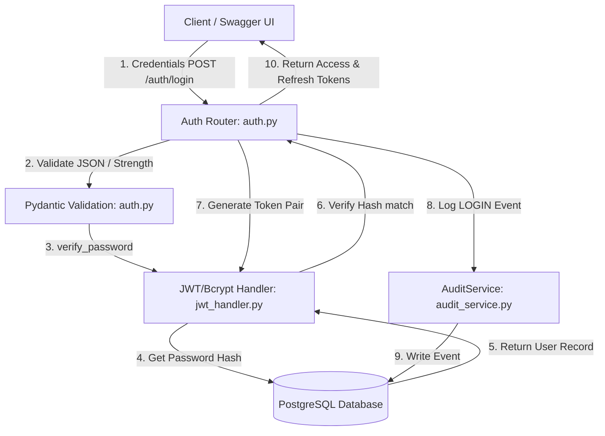
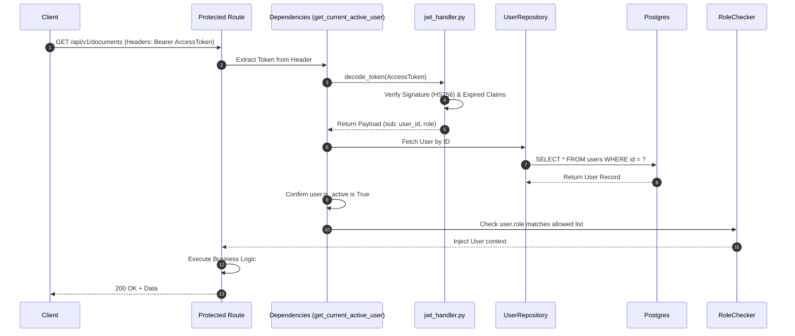
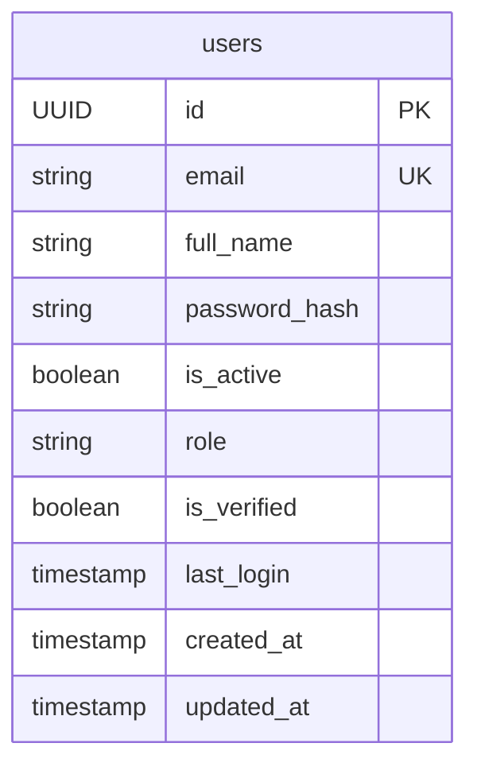
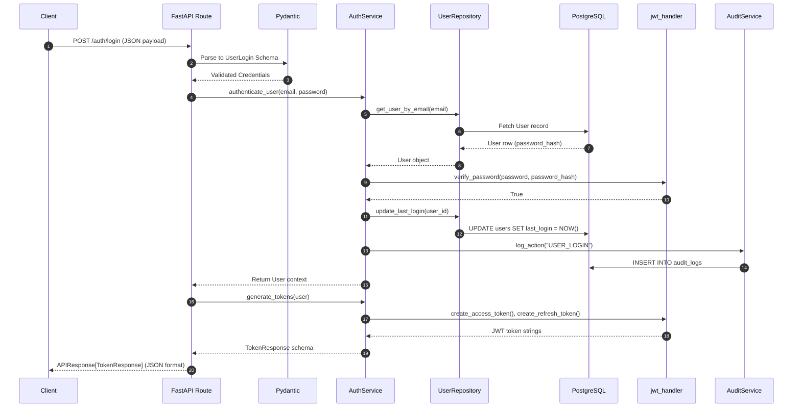

# Module 3 Technical Report: Authentication & User Management

---

## 1. Module Overview

### Metadata
*   **Module Name**: Authentication & User Management
*   **Module Version**: 1.0.0
*   **Development Status**: Completed & Verified
*   **Author**: Principal Security Architect & IAM Specialist
*   **Last Updated**: June 7, 2026
*   **Dependencies**: PyJWT 2.x, bcrypt 5.x, email-validator 2.x, FastAPI, SQLAlchemy
*   **Related Modules**: Module 1 (Project Setup), Module 2 (Database Foundation), Module 4 (OCR & RAG API protection)

### Explanation
#### What this module does
This module implements a fintech-grade Authentication, Authorization, and Identity Access Management (IAM) system. It features secure password hashing using bcrypt, token-based stateless authentication using JSON Web Tokens (JWT), refresh token rotation, Role-Based Access Control (RBAC), and user activity audit trail logging.

#### Why this module exists
In financial technology applications handling bank statements, transaction logs, and sensitive personal accounts, identity governance is a primary requirement. This module secures the platform against credential leaks, unauthorized horizontal/vertical access, and session hijacking.

#### Business Purpose
1.  **Compliance and Auditing**: Meet standards (such as SOC2, PCI-DSS, and GDPR) requiring user identity verification and logging of all authentication events.
2.  **Client Isolation**: Ensure that only authorized users can view, upload, or run RAG queries over their own uploaded statements.
3.  **Role Separation**: Divide operational tasks between administrators (`ADMIN`) and general consumers (`USER`).

#### Technical Purpose
1.  **Stateless Security**: Avoid keeping sessions in memory, allowing backend services to scale horizontally using short-lived JWT signatures.
2.  **Cryptographic Integrity**: Protect credentials from dictionary and rainbow table attacks.
3.  **API Gatekeeping**: Provide reusable FastAPI dependencies that validate user roles before executing downstream OCR, Chat, or Database RAG routines.

#### Problems Solved
*   **Horizontal Privilege Escalation**: Solved by embedding the user ID (`sub` claim) inside signed JWT access tokens, ensuring users can only access their own resources.
*   **Vertical Privilege Escalation**: Solved by implementing an RBAC dependency checker (`RoleChecker`) that blocks unauthorized roles at the API gateway layer.
*   **Stolen Token Risks**: Mitigated by utilizing short-lived Access Tokens (30 minutes) combined with long-lived Refresh Tokens (7 days) to limit the window of opportunity for intercepted tokens.

---

## 2. Module Architecture

The high-level architecture of Module 3 centers on a stateless OAuth2 Bearer token authentication paradigm:



### Authorization Flow (API Access)


---

## 3. Folder Structure Analysis

```
backend/app/
├── api/
│   ├── dependencies/
│   │   └── auth.py       <-- Injects current user contexts, enforces RBAC limits
│   └── v1/
│       └── auth.py       <-- Registration, Login, Logout, Profile routes
├── models/
│   └── user.py           <-- Mapped attributes: role, is_verified, last_login
├── schemas/
│   ├── auth.py           <-- Pydantic request/response validation definitions
│   └── common.py         <-- Standard APIResponse generic envelope
├── services/
│   ├── audit_service.py  <-- Logs security events to audit logs
│   └── auth_service.py   <-- Registers, authenticates, and updates user sessions
└── utils/
    └── jwt_handler.py    <-- Bcrypt hashing and PyJWT token signatures
```

### `app/api/dependencies/`
*   **Purpose**: Houses shared FastAPI dependency injection handlers.
*   **Responsibilities**: Extracts bearer tokens from authorization headers, decodes JWT payloads, and enforces role boundaries.

### `app/schemas/`
*   **Purpose**: Validates incoming request payloads and structures outgoing responses.
*   **Responsibilities**: Defines the shape of client request payloads and enforces password complexity requirements.

### `app/services/`
*   **Purpose**: Houses business logic workflows.
*   **Responsibilities**: Registers new users, verifies password hashes, generates tokens, and logs security audit logs.

### `app/utils/`
*   **Purpose**: Houses utility libraries.
*   **Responsibilities**: Performs low-level hashing and verification functions using `bcrypt` and token signing using `pyjwt`.

---

## 4. File-by-File Explanation

### [backend/app/utils/jwt_handler.py](file:///d:/Project/bank-rag/backend/app/utils/jwt_handler.py)
*   **Purpose**: Centralizes cryptographic operations.
*   **Key Functions**:
    *   `hash_password(password: str) -> str`: Generates a bcrypt salt and hashes the password string.
    *   `verify_password(plain_password: str, hashed_password: str) -> bool`: Verifies a password against a hash.
    *   `create_access_token(data: dict) -> str`: Generates a signed, short-lived JWT Access Token.
    *   `create_refresh_token(data: dict) -> str`: Generates a signed, long-lived JWT Refresh Token.
    *   `decode_token(token: str) -> dict`: Validates token signatures and expiration timestamps.
*   **Relationships**: Called by `AuthService` and security dependencies.

### [backend/app/schemas/auth.py](file:///d:/Project/bank-rag/backend/app/schemas/auth.py)
*   **Purpose**: Handles authentication request validation and response mapping.
*   **Key Classes**:
    *   `UserCreate`: Validates registration payloads. Enforces strong password rules.
    *   `UserResponse`: Maps the database user record to a clean outbound schema, excluding the password hash.
    *   `ChangePasswordRequest`: Validates password update payloads. Enforces password complexity rules.

### [backend/app/schemas/common.py](file:///d:/Project/bank-rag/backend/app/schemas/common.py)
*   **Purpose**: Standardizes API responses.
*   **Key Classes**:
    *   `APIResponse`: A generic envelope model ensuring consistent API structures:
        ```json
        {"success": true, "message": "Success message", "data": {}, "errors": null}
        ```

### [backend/app/repositories/user_repository.py](file:///d:/Project/bank-rag/backend/app/repositories/user_repository.py)
*   **Purpose**: Extends default repository operations for user records.
*   **Key Functions**:
    *   `get_user_by_email(db, email)`: Fetches a user by their email address.
    *   `update_last_login(db, user_id)`: Updates the `last_login` timestamp in the database.

### [backend/app/services/audit_service.py](file:///d:/Project/bank-rag/backend/app/services/audit_service.py)
*   **Purpose**: Writes system activity records to the database.
*   **Key Functions**:
    *   `log_action(db, user_id, action, resource, details)`: Creates and persists audit log records.

### [backend/app/services/auth_service.py](file:///d:/Project/bank-rag/backend/app/services/auth_service.py)
*   **Purpose**: Orchestrates authentication workflows.
*   **Key Functions**:
    *   `register_user(db, user_in)`: Validates email uniqueness, hashes passwords, creates user records, and logs audit entries.
    *   `authenticate_user(db, email, password)`: Verifies user status and password hashes.
    *   `generate_tokens(user)`: Issues a matching Access and Refresh token pair.
    *   `refresh_tokens(db, refresh_token)`: Validates refresh tokens and issues new token pairs.
    *   `change_password(db, user, password_in)`: Verifies the current password, updates it with a new hashed password, and logs the update.

### [backend/app/api/dependencies/auth.py](file:///d:/Project/bank-rag/backend/app/api/dependencies/auth.py)
*   **Purpose**: Enforces access control at the API layer.
*   **Key Classes/Functions**:
    *   `get_current_user`: Dependency that extracts the bearer token, validates the JWT signature, and retrieves the matching user record.
    *   `get_current_active_user`: Dependency that validates that the retrieved user is active.
    *   `RoleChecker`: Reusable class-based dependency used to restrict route access to specific roles.

### [backend/app/api/v1/auth.py](file:///d:/Project/bank-rag/backend/app/api/v1/auth.py)
*   **Purpose**: Declares authentication routes.
*   **Key Endpoints**:
    *   `POST /auth/register`: User registration route.
    *   `POST /auth/login`: User login route.
    *   `POST /auth/refresh`: Token refresh route.
    *   `POST /auth/logout`: User logout route.
    *   `GET /auth/me`: Fetches the current user profile.
    *   `POST /auth/change-password`: Password update route.

---

## 5. Technology Stack Analysis

### JSON Web Tokens (JWT)
*   **What**: An open standard (RFC 7519) for securely sharing information between parties as a JSON object.
*   **Why**: Used for stateless session management.
*   **Benefits**: Avoids the need to store session states in database tables, supporting horizontal scalability.
*   **Alternatives**: Session Cookies, Redis-backed sessions.
*   **Industry Usage**: Standard authentication mechanism for modern microservices and single-page applications.

### Bcrypt
*   **What**: A password-hashing function designed by Niels Provos and David Mazières.
*   **Why**: Used to secure user passwords before storing them in the database.
*   **Benefits**: Incorporates a work factor (salt rounds) to protect against brute-force attacks.
*   **Alternatives**: PBKDF2, Argon2, Scrypt.
*   **Industry Usage**: Industry-standard library for hashing passwords in web applications.

---

## 6. Dependency Analysis

### `pyjwt>=2.8.0`
*   **Purpose**: Signature creation and decoding of JSON Web Tokens.
*   **Used for**: Encoding access/refresh payloads and validating token structures.
*   **Benefits**: A lightweight Python library with built-in validation for claims like `exp` and `iat`.

### `bcrypt>=4.1.0`
*   **Purpose**: Cryptographic password hashing.
*   **Used for**: Encrypting plain text passwords during registration and updates.
*   **Benefits**: Offers robust security against database compromises.

### `email-validator>=2.1.0`
*   **Purpose**: Formats validation for email address strings.
*   **Used for**: Validating email format syntax inside `UserCreate` Pydantic models.
*   **Benefits**: Verifies that email addresses use valid domain formats.

---

## 7. Command Reference Guide

### Run Pytest Suite
```bash
.\venv\Scripts\pytest
```
*   **Purpose**: Executes the test suite.
*   **Expected Output**: Runs tests and outputs a pass/fail summary.

### Rebuild and Start Containers
```bash
docker compose down; docker compose up --build -d
```
*   **Purpose**: Rebuilds backend images and starts the environment.
*   **Expected Output**: Starts the PostgreSQL database and FastAPI backend services.

---

## 8. Configuration Files

### [.env](file:///d:/Project/bank-rag/.env)
*   **Purpose**: Stores environment variables.
*   **Important Settings**:
    *   `SECRET_KEY`: Hexadecimal string used to sign JWT signatures.
    *   `ALGORITHM`: Signature method (`HS256`).
    *   `ACCESS_TOKEN_EXPIRE_MINUTES`: Expiration time for access tokens (`30`).
    *   `REFRESH_TOKEN_EXPIRE_DAYS`: Expiration time for refresh tokens (`7`).

---

## 9. API Documentation

### `POST /api/v1/auth/register`
*   **Method**: `POST`
*   **Purpose**: Registers a new user.
*   **Request Body**:
    ```json
    {
      "email": "user@example.com",
      "full_name": "John Doe",
      "password": "StrongPassword@123"
    }
    ```
*   **Response**:
    ```json
    {
      "success": true,
      "message": "User registered successfully",
      "data": {
        "id": "7ca64730-22c6-4d1a-821b-689e4726cd55",
        "email": "user@example.com",
        "full_name": "John Doe",
        "role": "USER",
        "is_active": true,
        "is_verified": false,
        "last_login": null,
        "created_at": "2026-06-07T17:44:39Z",
        "updated_at": "2026-06-07T17:44:39Z"
      },
      "errors": null
    }
    ```

### `POST /api/v1/auth/login`
*   **Method**: `POST`
*   **Purpose**: Authenticates credentials and issues tokens.
*   **Request Body**:
    ```json
    {
      "email": "user@example.com",
      "password": "StrongPassword@123"
    }
    ```
*   **Response**:
    ```json
    {
      "success": true,
      "message": "Login successful",
      "data": {
        "access_token": "eyJhbGciOiJIUzI1Ni...",
        "refresh_token": "eyJhbGciOiJIUzI1Ni...",
        "token_type": "bearer"
      },
      "errors": null
    }
    ```

---

## 10. Database Design



### Table Columns: `users`
*   `role`: String(50), defaults to `"USER"`. Has a database index for performance.
*   `is_verified`: Boolean, defaults to `False`. Tracks email verification status.
*   `last_login`: DateTime(timezone=True), nullable. Tracks the user's last login date.

---

## 11. Business Logic Explanation

### Password Complexity Rules
The system enforces password requirements during registration and password updates:
1.  **Length Check**: Must be between 8 and 128 characters.
2.  **Character Types**: Requires at least one uppercase letter, one lowercase letter, one digit, and one special character.

---

## 12. Execution Flow



---

## 13. Security Analysis

*   **Credential Protection**: Passwords are hashed with bcrypt before database storage. Plain text passwords are never stored or logged.
*   **JWT Integrity**: Signed using `HS256` with a `SECRET_KEY` loaded from environment variables.
*   **SQL Injection Protection**: Handled by SQLAlchemy's query parameter binding.
*   **Role-Based Access Control**: Enforced using the `RoleChecker` dependency to secure endpoints based on user roles.

---

## 14. Logging & Monitoring

*   **Audit Trail Logs**: Crucial security events (login, registration, password updates) are logged to the `audit_logs` table.
*   **App Logs**: Errors and failed authentication attempts are recorded using standard loggers.

---

## 15. Error Handling

*   **Invalid Credentials**: Returns a `401 Unauthorized` status code.
*   **Expired Token**: Returns a `401 Unauthorized` status code.
*   **Missing Permissions**: Returns a `403 Forbidden` status code.
*   **Duplicate Registration**: Returns a `400 Bad Request` status code.

---

## 16. Testing Strategy

*   **Test Isolation**: Tests are run against a dedicated `bank_statement_rag_test` database.
*   **Integration Checks**:
    *   `test_user_registration_service`: Tests password hashing and email uniqueness.
    *   `test_user_login_authentication`: Validates credentials checks and last login updates.
    *   `test_token_refresh_exchange`: Verifies token rotation logic.
    *   `test_rbac_role_checker`: Validates permissions checks for different user roles.

---

## 17. Deployment Guide

Ensure the following environment variables are set before deployment:
*   `SECRET_KEY`: A secure hexadecimal key.
*   `ALGORITHM`: Set to `HS256`.
*   `ACCESS_TOKEN_EXPIRE_MINUTES`: Defaults to `30`.
*   `REFRESH_TOKEN_EXPIRE_DAYS`: Defaults to `7`.

---

## 18. Performance Considerations

*   **Password Hashing Overhead**: Bcrypt hashing is computationally intensive by design to slow down brute-force attacks.
*   **Database Indexing**: The `role` column is indexed to optimize queries filtering by user role.
*   **Stateless Scaling**: Using JWTs reduces database query overhead for session checks on protected routes.

---

## 19. Module Integration

*   **Integration with Module 2**: Extends the `BaseRepository` and `User` model definitions.
*   **Downstream Integration**: Provides the `get_current_active_user` and `RoleChecker` dependencies to secure endpoints in future modules (like statement upload and RAG search).

---

## 20. Learning Section

### Key Concepts

#### Cryptographic Hashing vs Encryption
Hashing is a one-way function that cannot be decrypted, making it ideal for storing passwords. Encryption is two-way and can be decrypted using a key.

#### Stateless Session Management
JWTs enable stateless authentication. Since the server can verify the token signature using a secret key, it does not need to look up session records in a database for every request.

---

## 21. Troubleshooting Guide

### Issue: `ProgrammingError: relation "users" does not exist` during local test runs
*   **Root Cause**: The test database schema is out of sync.
*   **Solution**: Ensure you are using the isolated `bank_statement_rag_test` database configuration for tests and run migrations using Alembic.

### Issue: `ExpiredSignatureError`
*   **Root Cause**: The access token has expired (expires in 30 minutes).
*   **Solution**: Send a request to `POST /auth/refresh` with a valid refresh token to get a new access token.

---

## 22. Future Enhancements

*   **OAuth2 Integrations**: Plan to add Google and GitHub social logins.
*   **Multi-Factor Authentication (MFA)**: Support TOTP (Google Authenticator) verification.
*   **Token Revocation**: Implement a Redis-backed blacklist to invalidate tokens before they expire.

---

## 23. Key Takeaways

*   **Module Purpose**: Implements authentication, token-based sessions, and role checks.
*   **Primary Technologies**: PyJWT, bcrypt, FastAPI, PostgreSQL.
*   **Critical Files**: `jwt_handler.py`, `auth.py` dependencies, `auth.py` router.
*   **Verify command**: `pytest`

---

## 24. Appendix

### Glossary
*   **JWT**: JSON Web Token.
*   **RBAC**: Role-Based Access Control.
*   **IAM**: Identity and Access Management.
*   **MFA**: Multi-Factor Authentication.
*   **Bcrypt**: A blowfish-based password hashing algorithm.
