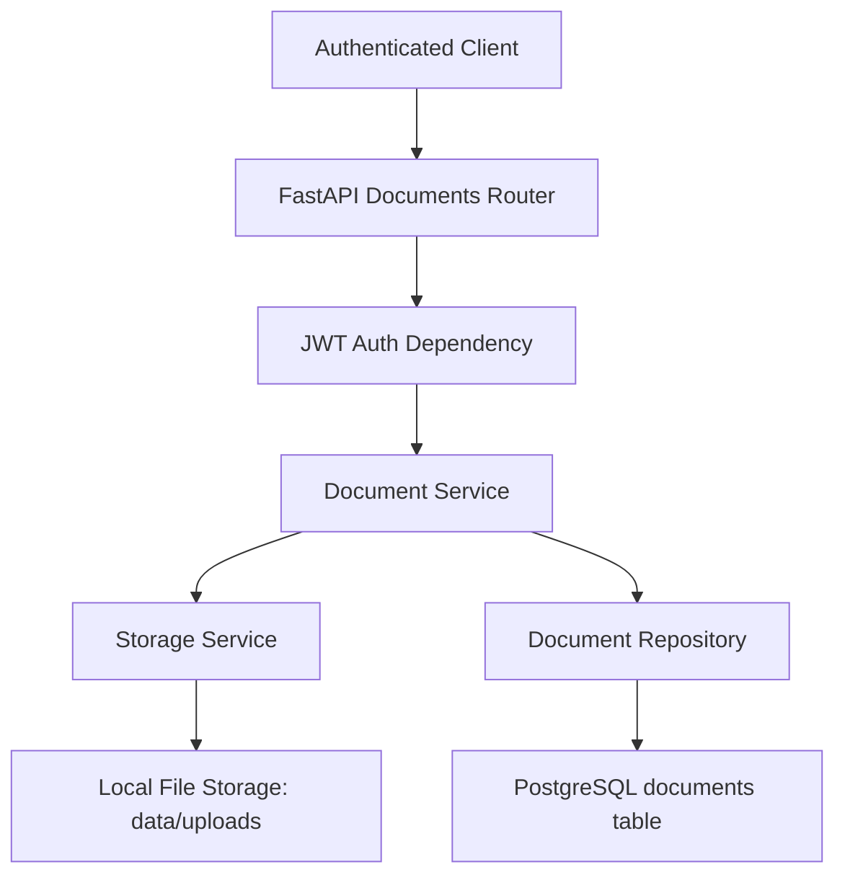
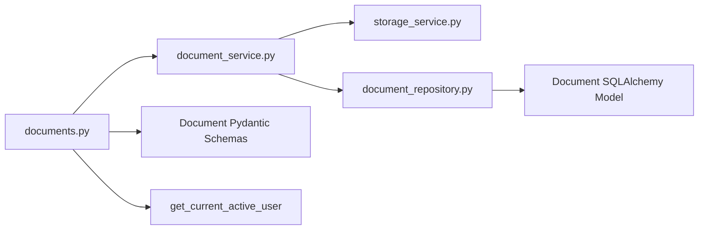
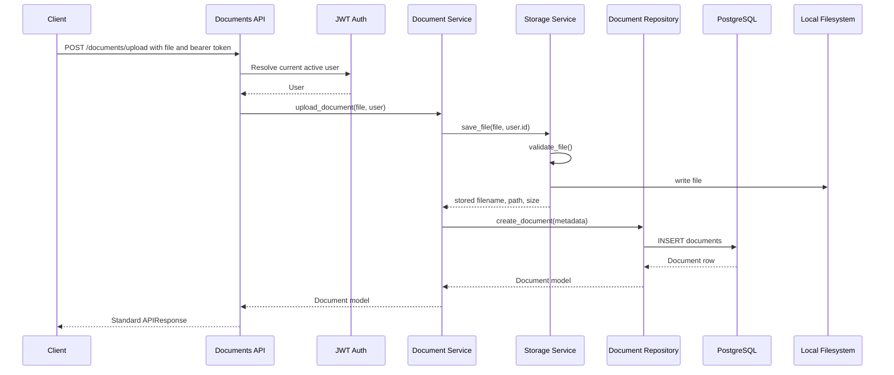
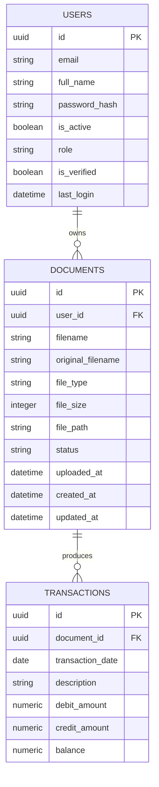

# Module 4 Technical Report - Document Upload and Document Management

## 1. Module Overview

### Module Metadata

| Field | Value |
| --- | --- |
| Module Name | Document Upload and Document Management |
| Module Version | 1.0.0 |
| Development Status | Implemented, pending database-backed test execution |
| Author | Project Engineering Team / Codex |
| Last Updated | 2026-06-07 |
| Project | AI-Powered Bank Statement Analysis using Hybrid RAG |
| Primary Runtime | Python FastAPI backend |

### Dependencies

This module depends on:

- Module 1 - Project Setup and Environment
- Module 2 - PostgreSQL, SQLAlchemy, and Alembic
- Module 3 - Authentication and User Management
- FastAPI multipart upload support through `python-multipart`
- PostgreSQL for document metadata
- Local filesystem storage through `data/uploads`

### Related Modules

- Previous: Authentication and User Management
- Future: PDF Processing, OCR, Transaction Extraction, Embeddings, Hybrid RAG

### What This Module Does

This module allows authenticated users to upload, list, view, and delete bank statement documents. It supports PDF, CSV, and XLSX files up to 20 MB. The uploaded binary files are stored on the local filesystem, while metadata is stored in PostgreSQL.

### Why This Module Exists

The project cannot process bank statements until users have a secure way to submit source files. This module becomes the ingestion gateway for all downstream intelligence features.

Business purpose:

- Let users manage their own bank statement files.
- Provide a controlled upload path for statement analysis.
- Keep uploaded files available for future processing stages.

Technical purpose:

- Validate uploaded files before persistence.
- Store files in predictable user-scoped directories.
- Persist metadata for querying, processing, and ownership checks.
- Expose a clean API contract for future processing modules.

Problems solved:

- Prevents anonymous uploads.
- Rejects unsupported or oversized files.
- Prevents path traversal through sanitized filenames and root path validation.
- Ensures users cannot access each other's documents.
- Establishes document status tracking for asynchronous processing.

---

## 2. Module Architecture

### High-Level Architecture

The module follows a layered backend architecture:

- API layer: FastAPI routes receive requests and return standardized responses.
- Authentication dependency: JWT validation identifies the current active user.
- Service layer: Coordinates business rules and file/database operations.
- Storage service: Validates and saves physical files.
- Repository layer: Encapsulates SQLAlchemy metadata persistence.
- Database layer: PostgreSQL stores document metadata.
- Filesystem layer: Local disk stores uploaded document content.



### Internal Architecture



### Data Flow

For upload:

1. Client sends `multipart/form-data` to `POST /api/v1/documents/upload`.
2. FastAPI extracts the uploaded file.
3. JWT dependency validates the bearer token.
4. Storage service validates extension, MIME type, size, and destination path.
5. Storage service writes the file under `data/uploads/user_<user_id>/`.
6. Document service creates metadata through the repository.
7. API returns a standardized success response.

For list and detail:

1. Client sends a JWT-authenticated request.
2. Document service queries only records belonging to the current user.
3. API serializes metadata using Pydantic response schemas.

For delete:

1. Client requests document deletion by UUID.
2. Service confirms the document exists and belongs to the current user.
3. Repository deletes metadata.
4. Storage service deletes the physical file if it exists.

### Request Flow



### Component Interaction

Input sources:

- Multipart file uploads from authenticated clients.
- JWT bearer tokens issued by Module 3.

Processing layer:

- FastAPI routing.
- Dependency injection for database session and current user.

Business logic layer:

- `DocumentService`
- `StorageService`

Data storage layer:

- PostgreSQL `documents` table.
- Local filesystem under `data/uploads`.

Output layer:

- Pydantic response schemas wrapped in `APIResponse`.
- HTTP status codes and JSON error payloads.

---

## 3. Folder Structure Analysis

### `backend/app/api/`

Purpose:

- Contains HTTP API route definitions and dependencies.
- Separates external API contracts from business logic.

Responsibilities:

- Define endpoint URLs, HTTP methods, status codes, and response models.
- Attach authentication dependencies.
- Convert service-layer results into API responses.

Example files:

- `backend/app/api/v1/documents.py`: Document upload and management endpoints.
- `backend/app/api/dependencies/auth.py`: JWT authentication and role dependencies.

Best practice:

- Keeping API files thin makes routes easier to review and prevents business rules from being scattered across controllers.

### `backend/app/api/v1/`

Purpose:

- Groups versioned API endpoints.

Responsibilities:

- Preserve backward compatibility as APIs evolve.
- Allow future `/api/v2` endpoints without breaking clients.

Example files:

- `auth.py`: Authentication endpoints.
- `documents.py`: Document endpoints.

### `backend/app/core/`

Purpose:

- Stores application-wide settings and infrastructure configuration.

Responsibilities:

- Load environment variables.
- Expose centralized settings.
- Configure logging.

Example files:

- `config.py`: Adds upload settings: `UPLOAD_DIR`, `MAX_FILE_SIZE`, `ALLOWED_FILE_TYPES`.
- `logging_config.py`: Configures logging behavior.

### `backend/app/database/`

Purpose:

- Contains database connection and session management.

Responsibilities:

- Create SQLAlchemy async engine.
- Provide request-scoped `AsyncSession`.
- Commit or roll back transactions.

Example files:

- `session.py`: Provides `get_db`.

### `backend/app/models/`

Purpose:

- Contains SQLAlchemy ORM models.

Responsibilities:

- Define database table structures.
- Define relationships between entities.
- Provide Python objects mapped to database rows.

Example files:

- `document.py`: Defines the `Document` model.
- `user.py`: Defines users and relationship to documents.
- `base.py`: Defines shared UUID primary key and timestamps.

### `backend/app/repositories/`

Purpose:

- Encapsulates database query logic.

Responsibilities:

- Create, read, update, and delete database rows.
- Keep SQLAlchemy queries out of services and routes.

Example files:

- `document_repository.py`: Document metadata persistence.
- `base.py`: Generic async CRUD helper.

### `backend/app/schemas/`

Purpose:

- Contains Pydantic models used for API contracts.

Responsibilities:

- Validate and serialize responses.
- Hide internal fields such as `file_path` from API consumers.

Example files:

- `document.py`: `DocumentResponse`, `DocumentUploadResponse`, `DocumentListResponse`.
- `common.py`: Standard `APIResponse` envelope.

### `backend/app/services/`

Purpose:

- Contains business logic and orchestration.

Responsibilities:

- Apply validation rules.
- Coordinate filesystem and database operations.
- Enforce ownership checks.

Example files:

- `storage_service.py`: File validation, saving, and deleting.
- `document_service.py`: Upload/list/get/delete orchestration.

### `backend/alembic/`

Purpose:

- Stores database migration infrastructure.

Responsibilities:

- Apply schema changes safely over time.
- Track migration history.

Example files:

- `env.py`: Loads app metadata for migrations.
- `versions/1eefc2901ba4_update_document_schema_for_uploads.py`: Module 4 schema migration.

### `backend/tests/`

Purpose:

- Stores automated tests.

Responsibilities:

- Validate API and service behavior.
- Protect against regressions.

Example files:

- `test_documents.py`: Upload, list, and delete API tests.
- `conftest.py`: Database fixtures.

### `data/uploads/`

Purpose:

- Stores uploaded bank statement files.

Responsibilities:

- Persist user-uploaded source documents.
- Provide raw input for future processing modules.

Best practice:

- Uploaded files are outside the application source tree and mounted into Docker through `./data:/app/data`.

---

## 4. File-by-File Explanation

### `backend/app/api/v1/documents.py`

Purpose:

- Defines the external HTTP API for document management.

Responsibilities:

- Upload one document.
- List the current user's documents.
- Fetch document metadata.
- Delete a document.
- Apply JWT authentication to every route.

Key functions:

- `upload_document`: Handles `POST /documents/upload`, receives `UploadFile`, calls `document_service.upload_document`, returns `DocumentUploadResponse`.
- `list_documents`: Handles `GET /documents`, returns current user's documents.
- `get_document`: Handles `GET /documents/{document_id}`, returns one document if owned by the user.
- `delete_document`: Handles `DELETE /documents/{document_id}`, deletes metadata and file.

Relationships:

- Depends on `get_current_active_user`, `get_db`, document schemas, and `document_service`.
- Used by `app/main.py` through router inclusion.

Execution flow:

- Called by FastAPI when an HTTP request matches one of its routes.

### `backend/app/services/storage_service.py`

Purpose:

- Owns filesystem-specific upload behavior.

Responsibilities:

- Validate file presence.
- Validate extension.
- Validate MIME type.
- Validate non-empty file.
- Validate maximum file size.
- Sanitize filenames.
- Prevent path traversal.
- Save files to disk.
- Delete files from disk.

Key class:

- `StorageService`: Reusable storage component for local upload persistence.

Key functions:

- `_upload_root`: Resolves upload root.
- `_user_directory`: Builds `user_<user_id>` directory.
- `_sanitize_filename`: Removes unsafe filename characters.
- `_extension`: Extracts lowercase file extension.
- `_ensure_safe_path`: Confirms paths remain inside upload root.
- `validate_file`: Applies extension, MIME type, and size rules.
- `save_file`: Saves the uploaded file and returns metadata.
- `delete_file`: Deletes a stored file if present.

Relationships:

- Depends on `settings`.
- Called by `document_service.py`.

Execution flow:

- Upload flow calls `save_file`.
- Delete flow calls `delete_file`.

### `backend/app/services/document_service.py`

Purpose:

- Coordinates document business logic.

Responsibilities:

- Upload a document.
- Create metadata after storage succeeds.
- Clean up physical files if database persistence fails.
- Enforce ownership for get and delete operations.
- List only the authenticated user's documents.

Key class:

- `DocumentService`

Key functions:

- `upload_document`: Saves file then stores metadata.
- `get_document`: Loads one document and verifies ownership.
- `list_documents`: Lists current user's documents.
- `delete_document`: Deletes metadata and file.

Relationships:

- Depends on `storage_service`, `document_repo`, `User`, and `Document`.
- Used by `documents.py`.

Execution flow:

- Called by API routes after authentication succeeds.

### `backend/app/repositories/document_repository.py`

Purpose:

- Encapsulates document database access.

Responsibilities:

- Create metadata.
- Fetch document by id.
- Fetch documents by user.
- Delete metadata.
- Update processing status.

Key class:

- `DocumentRepository`

Key functions:

- `create_document`: Inserts a document row.
- `get_document_by_id`: Fetches a document by UUID.
- `get_documents_by_user`: Lists user-owned documents ordered by `uploaded_at`.
- `delete_document`: Deletes a document row.
- `update_status`: Updates status for downstream processing.

Relationships:

- Depends on SQLAlchemy `AsyncSession` and `Document`.
- Used by `document_service.py` and future processing workers.

### `backend/app/schemas/document.py`

Purpose:

- Defines public API response shapes.

Responsibilities:

- Serialize document metadata.
- Hide internal `file_path`.
- Provide consistent upload and list responses.

Key classes:

- `DocumentResponse`: Detailed metadata response.
- `DocumentUploadResponse`: Small response after upload.
- `DocumentListResponse`: Container for document list responses.

Relationships:

- Used by `documents.py`.
- Reads attributes from SQLAlchemy models through `ConfigDict(from_attributes=True)`.

### `backend/app/models/document.py`

Purpose:

- Defines the `documents` database table.

Responsibilities:

- Store ownership through `user_id`.
- Store original and stored filenames.
- Store file type and size.
- Store filesystem path.
- Track processing status.
- Track upload time.

Key class:

- `Document`

Relationships:

- Belongs to `User`.
- Has many `Transaction` rows.

### `backend/app/core/config.py`

Purpose:

- Centralizes application settings.

Module 4 settings:

- `UPLOAD_DIR`: Base directory for local uploads.
- `MAX_FILE_SIZE`: Maximum upload size in bytes.
- `ALLOWED_FILE_TYPES`: Comma-separated list of allowed extensions.
- `allowed_extensions`: Parsed list helper.

Relationships:

- Used by storage service, database session, and main app.

### `backend/app/main.py`

Purpose:

- Creates the FastAPI app and includes routers.

Module 4 responsibility:

- Includes `documents_router` under `settings.API_V1_STR`, creating `/api/v1/documents`.

### `backend/alembic/env.py`

Purpose:

- Alembic migration runtime.

Module 4 change:

- Imports `app.models` so all mapped models are loaded into metadata for migration generation.

### `backend/alembic/versions/1eefc2901ba4_update_document_schema_for_uploads.py`

Purpose:

- Migrates the older document schema into the upload-management schema.

Responsibilities:

- Adds `file_path`, `status`, and `uploaded_at`.
- Copies old values from `filename`, `processing_status`, and `upload_timestamp`.
- Creates `ix_documents_status`.
- Drops older processing columns.

### `backend/tests/test_documents.py`

Purpose:

- Provides minimal API tests for Module 4.

Responsibilities:

- Test upload API.
- Test list API.
- Test delete API.
- Override upload directory to a temporary path.
- Use existing database fixtures and JWT token generation.

---

## 5. Technology Stack Analysis

### Python

What:

- General-purpose programming language used for the backend.

Why used:

- Strong ecosystem for APIs, data processing, machine learning, and document processing.

Benefits:

- Readable syntax.
- Mature libraries.
- Excellent AI and data tooling.

Alternatives:

- Node.js, Java, Go, C#.

Industry usage:

- Common in fintech, data engineering, AI systems, and backend APIs.

### FastAPI

What:

- Modern Python web framework for APIs.

Why used:

- Provides async support, dependency injection, automatic OpenAPI docs, and Pydantic integration.

Benefits:

- Fast development.
- Type-driven validation.
- Built-in Swagger UI.
- Strong async performance.

Alternatives:

- Flask, Django REST Framework, Express.js, NestJS.

Industry usage:

- Widely used for microservices, ML APIs, and internal platforms.

### SQLAlchemy

What:

- Python ORM and SQL toolkit.

Why used:

- Maps Python classes to relational tables and supports async database sessions.

Benefits:

- Strong query abstraction.
- Relationship modeling.
- Transaction control.

Alternatives:

- Django ORM, Tortoise ORM, Prisma, raw SQL.

Industry usage:

- Common in production Python services.

### Alembic

What:

- Database migration tool for SQLAlchemy.

Why used:

- Tracks schema evolution over time.

Benefits:

- Versioned migrations.
- Upgrade and downgrade support.
- Autogeneration support.

Alternatives:

- Flyway, Liquibase, Django migrations.

Industry usage:

- Standard migration tool in SQLAlchemy projects.

### PostgreSQL

What:

- Relational database.

Why used:

- Stores durable metadata and relational relationships.

Benefits:

- ACID transactions.
- Strong indexing.
- UUID support.
- Reliable constraints.

Alternatives:

- MySQL, MariaDB, SQLite, SQL Server.

Industry usage:

- Common in financial and analytics-backed applications.

### Pydantic

What:

- Data validation and serialization library.

Why used:

- Defines API response models and validates structured data.

Benefits:

- Type safety.
- Automatic JSON serialization.
- Clear API contracts.

Alternatives:

- Marshmallow, dataclasses, Cerberus.

Industry usage:

- Standard with FastAPI services.

### Docker and Docker Compose

What:

- Containerization and local service orchestration tools.

Why used:

- Runs backend and PostgreSQL consistently across environments.

Benefits:

- Reproducible setup.
- Easy local dependency startup.
- Isolated runtime.

Alternatives:

- Podman, Kubernetes, direct local installs.

Industry usage:

- Standard for development and deployment workflows.

### Pytest

What:

- Python testing framework.

Why used:

- Runs unit and integration tests.

Benefits:

- Simple fixtures.
- Async test support through plugins.
- Clean assertions.

Alternatives:

- unittest, nose2.

Industry usage:

- Very common in Python projects.

### HTTPX

What:

- Python HTTP client with async support.

Why used:

- Tests FastAPI routes in process through ASGI transport.

Benefits:

- Async-compatible.
- Can call the app without a live server.
- Good API test ergonomics.

Alternatives:

- requests, aiohttp, FastAPI TestClient.

---

## 6. Dependency Analysis

### `fastapi>=0.115.0`

Purpose:

- API framework.

Used for:

- Routing.
- Dependency injection.
- `UploadFile`.
- HTTP exceptions.
- Response models.

### `uvicorn>=0.32.0`

Purpose:

- ASGI server.

Used for:

- Running the FastAPI application locally or in Docker.

### `python-dotenv>=1.0.1`

Purpose:

- Environment variable loading.

Used for:

- Reading `.env` values during development.

### `pydantic-settings>=2.5.0`

Purpose:

- Settings management.

Used for:

- `Settings` class in `config.py`.

### `pydantic>=2.9.0`

Purpose:

- Data validation and serialization.

Used for:

- API schemas and response envelopes.

### `sqlalchemy>=2.0.35`

Purpose:

- ORM and database abstraction.

Used for:

- Models, async sessions, queries, updates, and relationships.

### `alembic>=1.13.3`

Purpose:

- Database migrations.

Used for:

- Document schema update.

### `asyncpg>=0.30.0`

Purpose:

- Async PostgreSQL driver.

Used for:

- SQLAlchemy async PostgreSQL connections.

### `pytest>=8.3.0`

Purpose:

- Test runner.

Used for:

- Running module tests.

### `pytest-asyncio>=0.24.0`

Purpose:

- Async pytest support.

Used for:

- Async fixtures and tests.

### `httpx>=0.27.0`

Purpose:

- Async HTTP client.

Used for:

- In-process API tests with ASGI transport.

### `pyjwt>=2.13.0`

Purpose:

- JWT creation and decoding.

Used for:

- Authentication dependency and test tokens.

### `bcrypt>=5.0.0`

Purpose:

- Password hashing.

Used by:

- Module 3 authentication tests and user creation.

### `email-validator>=2.3.0`

Purpose:

- Email format validation.

Used by:

- Authentication schemas.

### `python-multipart>=0.0.9`

Purpose:

- Multipart form parsing.

Used for:

- File upload endpoints.

---

## 7. Command Reference Guide

### `pip install -r backend/requirements.txt`

Purpose:

- Installs backend dependencies.

Breakdown:

- `pip install`: package installation command.
- `-r`: install from requirements file.
- `backend/requirements.txt`: dependency list.

When to use:

- First setup, after dependencies change, in CI builds.

Expected output:

- Packages install successfully.

Troubleshooting:

- If `asyncpg` fails, verify Python version and network access.
- If `python-multipart` is missing, upload endpoints may fail at startup.

### `backend\venv\Scripts\python.exe -m pip install httpx>=0.27.0`

Purpose:

- Installs HTTPX into the Windows virtual environment.

When to use:

- When running document API tests and `ModuleNotFoundError: No module named 'httpx'` appears.

### `uvicorn app.main:app --reload`

Purpose:

- Starts the FastAPI development server.

Breakdown:

- `uvicorn`: ASGI server.
- `app.main`: Python module.
- `app`: FastAPI instance.
- `--reload`: restarts when code changes.

When to use:

- Local development from the backend directory.

Expected output:

- Server starts on `http://127.0.0.1:8000`.

### `docker compose up --build`

Purpose:

- Builds and starts backend and PostgreSQL services.

When to use:

- Local full-stack backend environment.

Expected output:

- PostgreSQL health check passes.
- Backend serves `/health`.

Troubleshooting:

- If port `5432` is occupied, stop the other PostgreSQL instance or change the port mapping.
- If uploads are not persisted, check the `./data:/app/data` volume.

### `docker compose down`

Purpose:

- Stops Docker Compose services.

When to use:

- End local environment.

### `alembic upgrade head`

Purpose:

- Applies all pending database migrations.

Breakdown:

- `alembic`: migration CLI.
- `upgrade`: move database forward.
- `head`: latest migration.

When to use:

- After pulling new migrations or creating a fresh database.

Expected output:

- Alembic applies migrations with no errors.

Troubleshooting:

- If connection fails, verify `.env` database settings and PostgreSQL availability.

### `alembic downgrade -1`

Purpose:

- Rolls back the latest migration.

When to use:

- Local debugging or rollback testing.

Warning:

- Use carefully in shared environments.

### `python -m pytest backend/tests/test_documents.py`

Purpose:

- Runs Module 4 tests.

Expected output:

- Upload, list, and delete tests pass when PostgreSQL is running.

Troubleshooting:

- `ConnectionRefusedError`: PostgreSQL is not reachable at configured host and port.
- `ModuleNotFoundError`: install dependencies in the active environment.

### `python -m compileall backend/app backend/tests`

Purpose:

- Checks Python syntax by compiling files.

When to use:

- Quick validation after edits.

Expected output:

- Files compile without syntax errors.

### `git status --short`

Purpose:

- Shows changed files.

When to use:

- Before committing or reviewing work.

### `git diff`

Purpose:

- Shows exact code changes.

When to use:

- Code review and self-review.

---

## 8. Configuration Files

### `.env`

Purpose:

- Stores local environment values.

Important settings:

- `PROJECT_NAME`: API display name.
- `PROJECT_VERSION`: API version metadata.
- `LOG_LEVEL`: Logging verbosity.
- `POSTGRES_USER`: PostgreSQL username.
- `POSTGRES_PASSWORD`: PostgreSQL password.
- `POSTGRES_DB`: Application database name.
- `POSTGRES_HOST`: PostgreSQL host.
- `POSTGRES_PORT`: PostgreSQL port.
- `CHROMA_HOST`: Future vector database host.
- `CHROMA_PORT`: Future vector database port.
- `OPENAI_API_KEY`: Future LLM integration secret.
- `SECRET_KEY`: JWT signing key.
- `ALGORITHM`: JWT signing algorithm.
- `ACCESS_TOKEN_EXPIRE_MINUTES`: Access token lifetime.
- `REFRESH_TOKEN_EXPIRE_DAYS`: Refresh token lifetime.
- `UPLOAD_DIR`: Upload storage root.
- `MAX_FILE_SIZE`: Maximum file size in bytes.
- `ALLOWED_FILE_TYPES`: Allowed extensions.

Impact:

- Controls upload validation, database connectivity, authentication, and runtime metadata.

### `docker-compose.yml`

Purpose:

- Orchestrates backend and PostgreSQL containers.

Important Module 4 setting:

```yaml
- ./data:/app/data
```

Impact:

- Uploaded files survive backend container restarts.

### `backend/Dockerfile`

Purpose:

- Builds backend image.

Important settings:

- `WORKDIR /app`
- `PYTHONPATH=/app`
- `COPY requirements.txt .`
- `pip install -r requirements.txt`
- `CMD ["uvicorn", "app.main:app", ...]`

Impact:

- Provides a consistent backend runtime.

### `backend/requirements.txt`

Purpose:

- Declares Python dependencies.

Important Module 4 dependencies:

- `python-multipart`: Required for file uploads.
- `httpx`: Required for API tests.
- `fastapi`: Upload endpoint and route definitions.

### `backend/alembic.ini`

Purpose:

- Alembic CLI configuration.

Impact:

- Alembic loads runtime DB URL through `alembic/env.py`, which reads app settings.

---

## 9. API Documentation

Base path:

```text
/api/v1/documents
```

Authentication:

- All endpoints require `Authorization: Bearer <access_token>`.

### `POST /api/v1/documents/upload`

Method:

- `POST`

Purpose:

- Uploads one bank statement document.

Request:

- Content type: `multipart/form-data`
- Field: `file`

Validation:

- File must be present.
- File must be non-empty.
- Extension must be `pdf`, `csv`, or `xlsx`.
- MIME type must match allowed type.
- File size must be less than or equal to 20 MB.

Example request:

```bash
curl -X POST http://localhost:8000/api/v1/documents/upload \
  -H "Authorization: Bearer <access_token>" \
  -F "file=@statement.pdf"
```

Example response:

```json
{
  "success": true,
  "message": "Document uploaded successfully",
  "data": {
    "document_id": "6c186165-b8c5-4fdf-9bc3-c103558bdc14",
    "filename": "statement.pdf",
    "status": "UPLOADED"
  },
  "errors": null
}
```

Error cases:

- `400`: missing file, invalid extension, invalid MIME type, empty file.
- `401`: invalid or missing JWT.
- `403`: inactive user.
- `413`: file too large.

### `GET /api/v1/documents`

Method:

- `GET`

Purpose:

- Lists documents owned by the authenticated user.

Example request:

```bash
curl http://localhost:8000/api/v1/documents \
  -H "Authorization: Bearer <access_token>"
```

Example response:

```json
{
  "success": true,
  "message": "Documents retrieved successfully",
  "data": {
    "documents": [
      {
        "id": "6c186165-b8c5-4fdf-9bc3-c103558bdc14",
        "user_id": "9db31a9d-05c4-46cf-b983-6a6fd1edbd13",
        "filename": "a5c1_statement.pdf",
        "original_filename": "statement.pdf",
        "file_type": "pdf",
        "file_size": 234567,
        "status": "UPLOADED",
        "uploaded_at": "2026-06-07T18:00:00Z"
      }
    ]
  },
  "errors": null
}
```

Error cases:

- `401`: invalid or missing JWT.
- `403`: inactive user.

### `GET /api/v1/documents/{document_id}`

Method:

- `GET`

Purpose:

- Returns metadata for one user-owned document.

Example request:

```bash
curl http://localhost:8000/api/v1/documents/6c186165-b8c5-4fdf-9bc3-c103558bdc14 \
  -H "Authorization: Bearer <access_token>"
```

Example response:

```json
{
  "success": true,
  "message": "Document retrieved successfully",
  "data": {
    "id": "6c186165-b8c5-4fdf-9bc3-c103558bdc14",
    "user_id": "9db31a9d-05c4-46cf-b983-6a6fd1edbd13",
    "filename": "a5c1_statement.pdf",
    "original_filename": "statement.pdf",
    "file_type": "pdf",
    "file_size": 234567,
    "status": "UPLOADED",
    "uploaded_at": "2026-06-07T18:00:00Z"
  },
  "errors": null
}
```

Error cases:

- `404`: document not found or not owned by user.
- `401`: invalid or missing JWT.

### `DELETE /api/v1/documents/{document_id}`

Method:

- `DELETE`

Purpose:

- Deletes the document metadata and stored file.

Example request:

```bash
curl -X DELETE http://localhost:8000/api/v1/documents/6c186165-b8c5-4fdf-9bc3-c103558bdc14 \
  -H "Authorization: Bearer <access_token>"
```

Example response:

```json
{
  "success": true,
  "message": "Document deleted successfully",
  "data": null,
  "errors": null
}
```

Error cases:

- `404`: document not found or not owned by user.
- `401`: invalid or missing JWT.

---

## 10. Database Design

### Database Architecture

PostgreSQL stores relational metadata. The document binary itself is not stored in the database. This keeps the database lightweight and avoids expensive binary row storage.

### ER Diagram



### `documents` Table

Purpose:

- Stores metadata for uploaded bank statement files.

Columns:

| Column | Type | Purpose |
| --- | --- | --- |
| `id` | UUID | Primary key |
| `user_id` | UUID | Owner reference |
| `filename` | String(255) | Stored safe filename |
| `original_filename` | String(255) | User-provided original filename |
| `file_type` | String(50) | Extension such as pdf, csv, xlsx |
| `file_size` | Integer | File size in bytes |
| `file_path` | String(512) | Local storage path |
| `status` | String(50) | Processing status |
| `uploaded_at` | DateTime | Upload timestamp |
| `created_at` | DateTime | Base model creation timestamp |
| `updated_at` | DateTime | Base model update timestamp |

Relationships:

- `documents.user_id` references `users.id`.
- `transactions.document_id` references `documents.id`.

Indexes:

- `ix_documents_id`
- `ix_documents_user_id`
- `ix_documents_status`

Why it exists:

- Provides a durable metadata anchor for future extraction and RAG stages.

---

## 11. Business Logic Explanation

### Rule: Only Authenticated Users Can Manage Documents

Purpose:

- Prevent anonymous upload and data access.

Input:

- JWT bearer token.

Processing:

- `get_current_active_user` validates token and user status.

Output:

- Authenticated `User` object or HTTP error.

Edge cases:

- Expired token.
- Invalid token.
- Inactive user.

### Rule: Users Can Only Access Their Own Documents

Purpose:

- Enforce tenant isolation.

Input:

- `document_id` and current user.

Processing:

- `DocumentService.get_document` checks `document.user_id == user.id`.

Output:

- Document metadata or `404`.

Why `404` instead of `403`:

- Avoids revealing whether another user's document exists.

### Rule: Supported File Types Only

Purpose:

- Limit processing scope and reduce risk.

Allowed:

- PDF
- CSV
- XLSX

Rejected:

- EXE, ZIP, DOCX, images, unknown files.

### Rule: Maximum File Size Is 20 MB

Purpose:

- Prevent resource exhaustion.

Input:

- Uploaded file stream.

Processing:

- File stream seeks to end, measures bytes, and resets to beginning.

Output:

- Accepted file or `413`.

### Rule: Secure File Naming

Purpose:

- Prevent unsafe filenames and accidental collisions.

Processing:

- Extract basename only.
- Replace unsafe characters.
- Prefix with generated UUID hex.

Example:

```text
../../statement june.pdf
```

Becomes:

```text
<uuid>_statement_june.pdf
```

### Rule: Physical File and Metadata Must Stay Consistent

Purpose:

- Avoid orphan files.

Processing:

- Save file first.
- Create metadata second.
- If metadata creation fails, delete saved file.

---

## 12. Execution Flow

### Upload Execution Flow

```text
User Request
  -> Documents API
  -> JWT Authentication
  -> File Validation
  -> Local File Save
  -> Metadata Insert
  -> API Response
```

Detailed steps:

1. User selects a bank statement file.
2. Client sends multipart request.
3. FastAPI parses request into `UploadFile`.
4. Auth dependency resolves current user.
5. API route calls `document_service.upload_document`.
6. Storage service validates extension, MIME type, and size.
7. Storage service writes file to `data/uploads/user_<user_id>/`.
8. Document service calls repository to insert metadata.
9. Database transaction commits through `get_db`.
10. Client receives document id and status.

### List Execution Flow

1. User calls `GET /documents`.
2. Auth dependency resolves current user.
3. Document service fetches rows by `user_id`.
4. API returns `DocumentListResponse`.

### Delete Execution Flow

1. User calls `DELETE /documents/{document_id}`.
2. Service loads document.
3. Service verifies ownership.
4. Repository deletes metadata.
5. Storage service deletes physical file.
6. API returns success.

---

## 13. Security Analysis

### Authentication

- JWT bearer token required for every document endpoint.
- Implemented through `get_current_active_user`.

### Authorization

- Ownership validation occurs in service layer.
- A user can only get or delete documents where `document.user_id == current_user.id`.

### Input Validation

- Extension validation.
- MIME type validation.
- Size validation.
- Empty file validation.
- Path containment validation.

### Rate Limiting

Current status:

- Not implemented in Module 4.

Recommendation:

- Add API gateway or middleware rate limiting before production.

### Password Security

- Managed by Module 3 through bcrypt.
- Module 4 relies on authenticated identities.

### Token Handling

- Access tokens identify the user.
- Expired or invalid tokens are rejected.

### Secrets Management

- Secrets are read from environment variables.
- Production should use managed secret stores.

### Security Risks and Mitigations

| Risk | Mitigation |
| --- | --- |
| Path traversal | Basename extraction and root path validation |
| Oversized uploads | `MAX_FILE_SIZE` enforcement |
| Unauthorized access | JWT authentication |
| Cross-user data access | Ownership check |
| Dangerous file types | Extension and MIME validation |
| File collision | UUID-prefixed stored filename |

### OWASP Considerations

- Broken access control: mitigated by ownership checks.
- Security misconfiguration: environment-driven settings.
- Unrestricted file upload: mitigated by type, size, and path validation.
- Identification and authentication failures: handled by JWT dependency.

---

## 14. Logging and Monitoring

### Logging Strategy

The module uses Python `logging`.

Examples:

- Upload request received.
- File stored.
- Document uploaded.
- Document deleted.
- Unsafe path rejected.
- Metadata creation failure.

### Log Levels

- `INFO`: normal lifecycle events.
- `WARNING`: suspicious or rejected unsafe paths.
- `ERROR`/exception logging: database or metadata failures.

### Monitoring Tools

Current:

- Application logs.
- `/health` endpoint.

Recommended future tools:

- Prometheus metrics.
- Grafana dashboards.
- Centralized logging through ELK, OpenSearch, or CloudWatch.

### Useful Metrics

- Upload count.
- Upload failure count.
- Average file size.
- Storage usage.
- Processing status counts.
- Delete count.

### Alerting

Recommended:

- Alert when storage usage crosses threshold.
- Alert when `FAILED` processing status spikes.
- Alert when upload error rate rises.

---

## 15. Error Handling

### Missing File

Cause:

- Client did not provide multipart `file`.

Detection:

- FastAPI request parsing or storage validation.

User response:

- `400 Bad Request`.

Recovery:

- Send request with `file` field.

### Invalid File Type

Cause:

- Extension or MIME type is unsupported.

Detection:

- `StorageService.validate_file`.

User response:

- `400 Bad Request`.

Recovery:

- Upload PDF, CSV, or XLSX.

### File Too Large

Cause:

- File exceeds 20 MB.

Detection:

- File stream size measurement.

User response:

- `413 Request Entity Too Large`.

Recovery:

- Compress or split input file.

### Empty File

Cause:

- Uploaded file has zero bytes.

Detection:

- File size is less than or equal to zero.

User response:

- `400 Bad Request`.

Recovery:

- Upload a valid statement file.

### Document Not Found

Cause:

- UUID does not exist or belongs to another user.

Detection:

- Repository lookup and ownership check.

User response:

- `404 Not Found`.

Recovery:

- Verify document id.

### Database Failure

Cause:

- PostgreSQL unavailable or transaction failure.

Detection:

- SQLAlchemy exception.

Handling:

- Database dependency rolls back transaction.
- Upload service deletes the physical file if metadata creation fails.

Recovery:

- Restore database connectivity and retry.

---

## 16. Testing Strategy

### Unit Tests

Recommended unit targets:

- Storage validation.
- Filename sanitization.
- Ownership enforcement.
- Repository query methods.

### Integration Tests

Implemented:

- Upload API test.
- List documents API test.
- Delete document API test.

These tests exercise:

- FastAPI router.
- Authentication dependency override through real JWT token.
- Database fixture.
- Temporary upload directory.
- Metadata and file cleanup.

### E2E Tests

Future:

- Register user.
- Login.
- Upload document.
- Process document.
- Query transactions through RAG.

### Fixtures

Existing fixtures:

- `db_engine`
- `db_session`

Module 4 fixture:

- `authenticated_client`

### Test Commands

```bash
python -m pytest backend/tests/test_documents.py
```

Known environment requirement:

- PostgreSQL must be reachable at the configured host and port.

---

## 17. Deployment Guide

### Development Deployment

1. Create and activate virtual environment.
2. Install dependencies.
3. Start PostgreSQL.
4. Apply Alembic migrations.
5. Start FastAPI with Uvicorn.

### Docker Development Deployment

```bash
docker compose up --build
```

This starts:

- Backend API.
- PostgreSQL.
- Persistent upload volume.

### Staging Deployment

Recommendations:

- Use separate staging database.
- Use staging secret values.
- Run migrations as a deployment step.
- Mount persistent storage for uploads.

### Production Deployment

Recommendations:

- Use managed PostgreSQL.
- Use object storage such as S3 in a future module.
- Restrict CORS.
- Enable rate limiting.
- Use centralized logs.
- Add malware scanning for uploads.

### CI/CD

Recommended pipeline:

1. Install dependencies.
2. Run linting.
3. Run compile check.
4. Run tests against PostgreSQL service.
5. Build Docker image.
6. Apply migrations.
7. Deploy.

### Rollback Strategy

- Roll back application image.
- Use Alembic downgrade only if schema rollback is required and safe.
- Preserve `data/uploads` before destructive operations.

---

## 18. Performance Considerations

### Current Performance Profile

- Uploads are written synchronously within the request lifecycle.
- File size is limited to 20 MB.
- Metadata queries are indexed by user and status.

### Optimization Techniques

- Keep file size limits conservative.
- Index `user_id` and `status`.
- Return metadata only, not file bytes.

### Caching

Not required for this module.

Future:

- Cache document list if usage grows and invalidation is manageable.

### Database Optimization

- `user_id` index supports per-user document listing.
- `status` index supports worker queries for processing queues.

### Concurrency

- FastAPI supports async requests.
- Filesystem writes can still become a bottleneck under high upload load.

### Scaling Bottlenecks

- Local disk does not scale across multiple backend containers.
- Large concurrent uploads can consume I/O.
- No queue is currently used for post-upload processing.

### Future Improvements

- Move file storage to S3 or compatible object storage.
- Add asynchronous processing queue.
- Add upload progress support.
- Add background virus scanning.

---

## 19. Module Integration

### Integration With Module 2

Uses:

- SQLAlchemy models.
- Async sessions.
- Alembic migrations.
- PostgreSQL database.

### Integration With Module 3

Uses:

- JWT authentication.
- Current active user dependency.
- User model relationship.

### Future Integration With PDF Processing

PDF processor can:

- Query documents with `status = 'UPLOADED'`.
- Read `file_path`.
- Set status to `PROCESSING`.
- Extract text.
- Set status to `PROCESSED` or `FAILED`.

### Future Integration With OCR

OCR module can:

- Consume scanned PDFs from `file_path`.
- Store extracted text in a future table.
- Update document status.

### Future Integration With Transaction Extraction

Transaction extraction can:

- Use document id as foreign key.
- Store extracted transaction rows.
- Link every transaction back to its source document.

### Future Integration With Hybrid RAG

RAG module can:

- Embed extracted text and transaction summaries.
- Use document id as metadata.
- Restrict retrieval by user id for security.

Data contract:

```json
{
  "document_id": "uuid",
  "user_id": "uuid",
  "file_path": "data/uploads/user_<user_id>/<filename>",
  "status": "UPLOADED"
}
```

---

## 20. Learning Section

### Concept: Layered Architecture

The module separates routes, services, repositories, models, and schemas. This makes each layer easier to understand and test.

Interview question:

- Why should business logic not live directly in API routes?

Expected answer:

- Routes should focus on HTTP concerns. Services make business logic reusable, testable, and independent from transport details.

### Concept: Repository Pattern

Repository classes wrap database queries.

Interview question:

- What is the benefit of a repository layer?

Expected answer:

- It centralizes persistence logic and prevents services from depending on scattered query details.

### Concept: Service Layer Pattern

Services coordinate workflows.

Interview question:

- Why does upload logic belong in a service?

Expected answer:

- Upload requires validation, storage, metadata creation, and cleanup. A service keeps that workflow cohesive.

### Concept: Dependency Injection

FastAPI injects `db` and `current_user`.

Interview question:

- How does dependency injection improve testability?

Expected answer:

- Tests can override dependencies such as database sessions or authenticated users.

### Concept: Secure File Upload

File uploads are risky because attackers can upload unexpected content or paths.

Interview question:

- What checks are important for secure uploads?

Expected answer:

- Authentication, extension validation, MIME validation, size limits, filename sanitization, path traversal prevention, and future malware scanning.

### Concept: UUID Primary Keys

UUIDs are harder to guess than sequential ids.

Interview question:

- Why use UUIDs for user-owned documents?

Expected answer:

- They reduce enumeration risk and work well across distributed systems.

---

## 21. Troubleshooting Guide

### Problem: `ConnectionRefusedError` During Tests

Root cause:

- PostgreSQL is not running or not reachable at configured host/port.

Solution:

```bash
docker compose up postgres
```

Then rerun:

```bash
python -m pytest backend/tests/test_documents.py
```

### Problem: `ModuleNotFoundError: No module named 'httpx'`

Root cause:

- Test dependency missing from active environment.

Solution:

```bash
pip install -r backend/requirements.txt
```

### Problem: Upload Endpoint Fails at Startup

Root cause:

- `python-multipart` missing.

Solution:

```bash
pip install python-multipart
```

### Problem: User Gets `401 Unauthorized`

Root cause:

- Missing, invalid, or expired JWT.

Solution:

- Login again and send `Authorization: Bearer <access_token>`.

### Problem: User Gets `404 Document Not Found`

Root cause:

- Document id does not exist or belongs to another user.

Solution:

- Call `GET /api/v1/documents` to list accessible documents.

### Problem: Uploaded Files Disappear After Container Restart

Root cause:

- Data volume is not mounted.

Solution:

- Ensure `docker-compose.yml` contains `./data:/app/data`.

### Problem: File Rejected as Invalid Type

Root cause:

- Extension or MIME type is unsupported.

Solution:

- Upload PDF, CSV, or XLSX with correct content type.

---

## 22. Future Enhancements

### Scalability Upgrades

- Replace local storage with S3-compatible object storage.
- Add background processing queue.
- Support resumable uploads.
- Support upload progress reporting.

### Security Upgrades

- Add malware scanning.
- Add content sniffing.
- Add per-user storage quotas.
- Add rate limiting.
- Restrict CORS for production.

### Performance Upgrades

- Stream upload directly to object storage.
- Avoid reading file stream twice for large files.
- Add batch cleanup for orphan files.

### Product Enhancements

- Add document rename.
- Add download endpoint with signed URLs.
- Add status history.
- Add pagination and filtering.

### Technical Debt

- MIME type validation should eventually inspect file signatures.
- Delete operation currently removes DB metadata before file deletion; production systems may prefer a transactional outbox or cleanup job.
- Tests require a live PostgreSQL instance; a containerized test database would make CI more repeatable.

### Roadmap

1. Module 5: PDF text extraction.
2. Module 6: OCR for scanned statements.
3. Module 7: Transaction extraction.
4. Module 8: Embeddings and vector storage.
5. Module 9: Hybrid RAG query interface.

---

## 23. Key Takeaways

- Module 4 is the secure ingestion layer for bank statements.
- It supports PDF, CSV, and XLSX files up to 20 MB.
- Every endpoint requires JWT authentication.
- Ownership checks prevent cross-user access.
- Files are stored under `data/uploads/user_<user_id>/`.
- Metadata is stored in PostgreSQL.
- `status` prepares the system for future processing workers.
- Main files are `documents.py`, `document_service.py`, `storage_service.py`, `document_repository.py`, and `document.py`.
- Critical commands include `alembic upgrade head`, `uvicorn app.main:app --reload`, `docker compose up --build`, and `pytest`.
- The module demonstrates layered architecture, service pattern, repository pattern, dependency injection, secure upload validation, and database migration practices.

---

## 24. Appendix

### Glossary

API:

- Application Programming Interface. A contract used by clients to communicate with the backend.

JWT:

- JSON Web Token. A signed token used for authentication.

ORM:

- Object Relational Mapper. Maps database rows to Python objects.

Migration:

- A versioned database schema change.

Multipart:

- HTTP request format used for file uploads.

RAG:

- Retrieval-Augmented Generation. A pattern where relevant stored information is retrieved and provided to an LLM.

OCR:

- Optical Character Recognition. Converts images or scanned documents into text.

### Technical Terms

Path traversal:

- An attack where a filename attempts to escape an intended directory, such as `../../secret.txt`.

Content type:

- MIME type sent by the client describing uploaded content.

Metadata:

- Data about a file, such as filename, size, status, and owner.

### Acronyms

| Acronym | Meaning |
| --- | --- |
| API | Application Programming Interface |
| JWT | JSON Web Token |
| ORM | Object Relational Mapper |
| OCR | Optical Character Recognition |
| RAG | Retrieval-Augmented Generation |
| DB | Database |
| UUID | Universally Unique Identifier |
| MIME | Multipurpose Internet Mail Extensions |

### Useful References

- FastAPI documentation: https://fastapi.tiangolo.com/
- FastAPI file uploads: https://fastapi.tiangolo.com/tutorial/request-files/
- SQLAlchemy documentation: https://docs.sqlalchemy.org/
- Alembic documentation: https://alembic.sqlalchemy.org/
- Pydantic documentation: https://docs.pydantic.dev/
- PostgreSQL documentation: https://www.postgresql.org/docs/
- Docker Compose documentation: https://docs.docker.com/compose/
- OWASP file upload guidance: https://cheatsheetseries.owasp.org/cheatsheets/File_Upload_Cheat_Sheet.html

### Example Module 4 Review Checklist

- Are all document routes JWT protected?
- Does every document read or delete validate ownership?
- Are unsupported file types rejected?
- Are files larger than 20 MB rejected?
- Are filenames sanitized?
- Are stored paths constrained to `UPLOAD_DIR`?
- Does metadata exclude internal `file_path` from public responses?
- Does Docker persist `data/uploads`?
- Does Alembic migration preserve existing rows?
- Do upload, list, and delete tests pass with PostgreSQL running?
