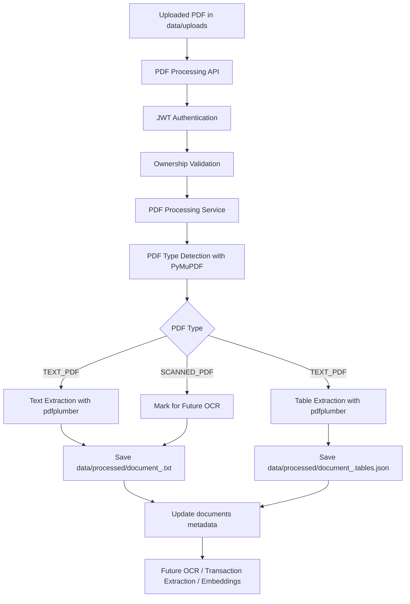

# Module 5 - PDF Processing Engine

## 1. Architecture Explanation

Module 5 processes uploaded PDF bank statements after Module 4 has stored the original file and document metadata. It detects whether the PDF contains selectable text, extracts text and simple tables from text-based PDFs, stores processed artifacts separately from uploads, and updates the document status for downstream modules.

This module deliberately does not perform OCR, transaction parsing, AI extraction, embedding generation, or bank-specific normalization.



## 2. Workflow

### PDF Processing Workflow

1. User uploads a PDF through Module 4.
2. User calls `POST /api/v1/documents/{document_id}/process`.
3. The API validates JWT authentication.
4. The service validates document ownership.
5. The service verifies that the file exists and is a PDF.
6. Document status changes from `UPLOADED` to `PROCESSING`.
7. PDF type detection runs.
8. Text and tables are extracted for text-based PDFs.
9. Processed artifacts are saved under `data/processed`.
10. Document metadata is updated to `PROCESSED`.
11. If processing fails, status is set to `FAILED`.

### Text Extraction Workflow

Text extraction uses `pdfplumber` because it provides reliable page-level text extraction for bank-statement-style PDFs. Extracted text is stored in a `.txt` file, with page separators added so future modules can preserve page context.

### Table Extraction Workflow

Table extraction uses `pdfplumber.extract_tables()`. Rows are normalized into dictionaries using the first row as headers. For example, a statement table may produce:

```json
[
  {
    "date": "01-05-2026",
    "description": "ATM Withdrawal",
    "debit": "5000",
    "credit": "",
    "balance": "25000"
  }
]
```

The table output is stored as JSON next to the text artifact:

```text
data/processed/document_<document_id>.tables.json
```

### OCR Integration

Scanned PDFs are detected as `SCANNED_PDF`. This module saves an empty processed text artifact and marks the document as processed with its PDF type. Module 6 can later query `pdf_type = 'SCANNED_PDF'` and run OCR against the original `file_path`.

### Transaction Extraction Integration

Module 7 can consume:

- `extracted_text_path`
- `document_<id>.tables.json`
- `pdf_type`
- `status`

This keeps transaction extraction separate from PDF parsing.

## 3. Folder Changes

```text
backend/app/api/v1/pdf_processing.py
backend/app/schemas/pdf_processing.py
backend/app/services/pdf_service.py
backend/app/utils/pdf_utils.py
backend/alembic/versions/8b0f5c4e91a2_add_pdf_processing_fields_to_documents.py
backend/tests/test_pdf_processing.py
documentation/module_5_pdf_processing_engine.md
data/processed/
```

## 4. Database Changes

The `documents` table now includes:

| Column | Type | Purpose |
| --- | --- | --- |
| `pdf_type` | String(50), nullable | `TEXT_PDF` or `SCANNED_PDF` |
| `extracted_text_path` | String(512), nullable | Path to processed text artifact |
| `processed_at` | DateTime(timezone=True), nullable | Processing completion or failure time |

Status transitions:

```text
UPLOADED -> PROCESSING -> PROCESSED
UPLOADED -> PROCESSING -> FAILED
```

## 5. Migration

Migration file:

```text
backend/alembic/versions/8b0f5c4e91a2_add_pdf_processing_fields_to_documents.py
```

Apply with:

```bash
alembic upgrade head
```

## 6. Utilities

File:

```text
backend/app/utils/pdf_utils.py
```

Functions:

- `detect_pdf_type(file_path)`: Uses PyMuPDF to detect selectable text. Returns `TEXT_PDF` or `SCANNED_PDF`.
- `extract_text(file_path)`: Uses pdfplumber to extract page text.
- `extract_tables(file_path)`: Uses pdfplumber to extract table rows.
- `save_processed_text(document_id, text, tables)`: Saves text and table JSON under `data/processed`.
- `load_processed_text(text_path)`: Reads processed text.
- `load_processed_tables(text_path)`: Reads table JSON.

## 7. Services

File:

```text
backend/app/services/pdf_service.py
```

Responsibilities:

- Validate document ownership.
- Validate file existence.
- Validate that the document is a PDF.
- Update status to `PROCESSING`.
- Detect PDF type.
- Extract text and tables for text PDFs.
- Save processed artifacts.
- Update metadata to `PROCESSED`.
- Mark status as `FAILED` on errors.

## 8. API Routes

File:

```text
backend/app/api/v1/pdf_processing.py
```

### `POST /api/v1/documents/{document_id}/process`

Processes a user-owned PDF.

Example response:

```json
{
  "success": true,
  "message": "Document processed successfully",
  "data": {
    "document_id": "6c186165-b8c5-4fdf-9bc3-c103558bdc14",
    "pdf_type": "TEXT_PDF",
    "status": "PROCESSED"
  },
  "errors": null
}
```

### `GET /api/v1/documents/{document_id}/processed`

Returns processed content.

Example response:

```json
{
  "success": true,
  "message": "Processed content retrieved successfully",
  "data": {
    "document_id": "6c186165-b8c5-4fdf-9bc3-c103558bdc14",
    "pdf_type": "TEXT_PDF",
    "status": "PROCESSED",
    "extracted_text": "Bank Statement...",
    "extracted_tables": []
  },
  "errors": null
}
```

## 9. Docker Changes

`backend/requirements.txt` now includes:

```text
pdfplumber>=0.11.0
PyMuPDF>=1.24.0
```

Docker builds install these automatically through:

```dockerfile
RUN pip install --no-cache-dir -r requirements.txt
```

The existing `./data:/app/data` volume covers both:

```text
data/uploads
data/processed
```

## 10. Minimal Tests

File:

```text
backend/tests/test_pdf_processing.py
```

Tests:

1. PDF type detection.
2. Text extraction.
3. Process endpoint.

Run:

```bash
backend\venv\Scripts\python.exe -m pytest backend\tests\test_pdf_processing.py
```

The endpoint test requires PostgreSQL to be reachable because it uses the existing database fixture.

## 11. Setup Instructions

1. Install dependencies:

   ```bash
   pip install -r backend/requirements.txt
   ```

2. Start PostgreSQL:

   ```bash
   docker compose up postgres
   ```

3. Apply migrations:

   ```bash
   cd backend
   alembic upgrade head
   ```

4. Start API:

   ```bash
   uvicorn app.main:app --reload
   ```

5. Upload a PDF through Module 4.

6. Process it:

   ```bash
   curl -X POST http://localhost:8000/api/v1/documents/<document_id>/process \
     -H "Authorization: Bearer <access_token>"
   ```

7. Read processed content:

   ```bash
   curl http://localhost:8000/api/v1/documents/<document_id>/processed \
     -H "Authorization: Bearer <access_token>"
   ```

## 12. Future Integration Notes

Module 6 OCR:

- Query documents where `pdf_type = 'SCANNED_PDF'`.
- Read original `file_path`.
- Store OCR text into the same processed artifact contract or a future OCR-specific table.

Module 7 Transaction Extraction:

- Read `extracted_text_path`.
- Read `document_<id>.tables.json`.
- Convert table rows and text lines into normalized transaction records.

Module 9 Embeddings:

- Read processed text from `extracted_text_path`.
- Chunk text.
- Generate embeddings.
- Store document id and user id as retrieval metadata.

Design rule:

- Module 5 prepares clean document content, but it does not decide transaction semantics or use AI.
