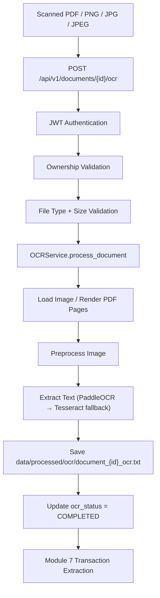

# Module 6 - OCR Engine

## 1. Module Overview

Module 6 adds an OCR (Optical Character Recognition) engine to the AI-Powered Bank Statement Analysis system. It converts scanned PDFs and image-based bank statements into machine-readable text that downstream modules can consume.

This module focuses exclusively on:

- Text detection from scanned documents
- Image preprocessing for OCR accuracy
- Text extraction and persistence
- Document OCR status tracking

This module does **not** perform transaction parsing, embedding generation, RAG processing, or AI analysis.

## 2. Purpose

Bank statements are often uploaded as:

- Scanned PDFs without a selectable text layer
- Mobile photos saved as PNG/JPG/JPEG

Module 5 detects scanned PDFs and marks them for OCR. Module 6 performs the actual text extraction and stores clean OCR output for Module 7 (Transaction Extraction) and Module 9 (Embeddings).

## 3. OCR Architecture

The OCR engine follows the same layered architecture used by Modules 4 and 5:

```text
API Layer (ocr.py)
    │
    ▼
Service Layer (ocr_service.py)
    │
    ├── Image Utilities (image_utils.py)
    ├── OCR Utilities (ocr_utils.py)
    └── Document Repository (document_repository.py)
```

### Design Principles

| Principle | Implementation |
|-----------|----------------|
| Service Layer Pattern | `OCRService` orchestrates validation, preprocessing, extraction, and persistence |
| Dependency Injection | FastAPI `Depends()` for auth and database sessions |
| Type Hints | Used across services, schemas, and utilities |
| Structured Logging | Module-level loggers with document/user context |
| Reusable Utilities | Image and OCR helpers are engine-agnostic |

## 4. OCR Workflow

### End-to-End Workflow



### Per-Document Processing Steps

1. Verify authenticated user ownership
2. Verify document exists on disk
3. Detect supported file type (`SCANNED_PDF`, `PNG`, `JPG`, `JPEG`)
4. Render PDF pages or load image files
5. Preprocess each page image
6. Extract text using PaddleOCR with Tesseract fallback
7. Save OCR output to `data/processed/ocr/`
8. Update `ocr_status`, `ocr_text_path`, and `ocr_processed_at`
9. Return standardized API response

## 5. OCR Pipeline Diagram

```text
Scanned PDF / Image
        │
        ▼
   Load Image(s)
        │
        ▼
 Image Preprocessing
  - Grayscale
  - Noise Reduction
  - Enhancement (CLAHE)
  - Adaptive Thresholding
        │
        ▼
   OCR Engine
  - PaddleOCR (primary)
  - Tesseract (fallback)
        │
        ▼
  Save OCR Text
        │
        ▼
 Processed Text File
        │
        ▼
 Transaction Extraction (Module 7)
```

## 6. OCR Libraries

### PaddleOCR (Primary)

**Why preferred:**

- Strong accuracy on multi-line financial documents
- Built-in text orientation detection
- Better performance on noisy scans and mixed layouts
- Handles printed bank statement fonts reliably

**Limitations:**

- Larger dependency footprint
- Slower cold start on first initialization
- Requires additional system libraries in Docker

### Tesseract OCR (Fallback)

**When used:**

- PaddleOCR is unavailable or fails to initialize
- PaddleOCR returns empty text for a page
- Lightweight environments where only Tesseract is installed

**Advantages:**

- Mature and widely available
- Small runtime footprint
- Easy to install in Docker via `tesseract-ocr`

**Limitations:**

- Lower accuracy on noisy or skewed scans
- Weak table structure preservation
- Sensitive to preprocessing quality

## 7. Supported File Types

| Type | Source | Validation Rule |
|------|--------|-----------------|
| `SCANNED_PDF` | Module 5 output | `pdf_type == SCANNED_PDF` and file exists |
| `PNG` | Direct upload | `file_type == png` |
| `JPG` | Direct upload | `file_type == jpg` |
| `JPEG` | Direct upload | `file_type == jpeg` |

### Validation Strategy

1. **Ownership** — document `user_id` must match authenticated user
2. **Existence** — `file_path` must exist on disk
3. **Type** — reject `TEXT_PDF` and unsupported extensions
4. **Size** — enforce `MAX_FILE_SIZE` from settings
5. **State** — reject duplicate OCR when `ocr_status == COMPLETED`
6. **PDF prerequisite** — scanned PDFs must pass Module 5 first

## 8. Image Preprocessing

| Step | Technique | Why It Helps |
|------|-----------|--------------|
| Grayscale Conversion | `cv2.cvtColor` | Reduces color noise and focuses OCR on luminance |
| Noise Reduction | `fastNlMeansDenoising` | Removes speckle from scanner artifacts |
| Image Enhancement | CLAHE | Improves local contrast for faint text |
| Thresholding | Adaptive Gaussian threshold | Produces sharp foreground text for OCR engines |

Preprocessed debug images are optionally saved under `data/processed/ocr/debug/`.

## 9. Folder Structure Changes

```text
backend/app/ocr/
├── __init__.py
├── services/
│   ├── __init__.py
│   └── ocr_service.py
└── utils/
    ├── __init__.py
    ├── image_utils.py
    └── ocr_utils.py

backend/app/api/v1/ocr.py
backend/app/schemas/ocr.py
backend/tests/test_ocr.py
backend/alembic/versions/c4f8a1d2e3b6_add_ocr_fields_to_documents.py
documentation/module_6_ocr_engine.md

data/processed/ocr/
├── document_{id}_ocr.txt
└── debug/
    └── document_{id}_page_{n}.png
```

## 10. Database Changes

Added to `documents` table:

| Column | Type | Description |
|--------|------|-------------|
| `ocr_status` | `VARCHAR(50)` | `NOT_REQUIRED`, `PENDING`, `PROCESSING`, `COMPLETED`, `FAILED` |
| `ocr_text_path` | `VARCHAR(512)` | Path to OCR output text file |
| `ocr_processed_at` | `TIMESTAMPTZ` | Timestamp when OCR completed or failed |

### Status Lifecycle

```text
NOT_REQUIRED  → text-based PDFs and non-OCR documents
PENDING       → scanned PDFs (after Module 5) or uploaded images
PROCESSING    → OCR currently running
COMPLETED     → OCR text saved successfully
FAILED        → OCR error occurred
```

## 11. API Endpoints

### POST `/api/v1/documents/{document_id}/ocr`

Runs OCR for an authenticated user's document.

**Response:**

```json
{
  "success": true,
  "message": "OCR completed successfully",
  "data": {
    "document_id": "uuid",
    "ocr_status": "COMPLETED"
  }
}
```

### GET `/api/v1/documents/{document_id}/ocr`

Returns OCR status and extracted text.

**Response:**

```json
{
  "success": true,
  "message": "OCR result retrieved successfully",
  "data": {
    "document_id": "uuid",
    "ocr_status": "COMPLETED",
    "ocr_text": "..."
  }
}
```

## 12. Integration with Module 5

Module 5 sets:

- `pdf_type = SCANNED_PDF` for image-only PDFs
- `ocr_status = PENDING` for scanned PDFs
- `ocr_status = NOT_REQUIRED` for text PDFs

Module 6 reads the original `file_path`, renders PDF pages at `OCR_DPI` (default 300), and writes OCR output to a separate artifact path.

## 13. Integration with Module 7

Module 7 (Transaction Extraction) will consume:

- `ocr_text_path` — primary OCR text artifact
- `extracted_text_path` — Module 5 text for `TEXT_PDF`
- `pdf_type` — routing between OCR and direct extraction
- `ocr_status` — pipeline gating

Recommended query for OCR-ready documents:

```sql
SELECT * FROM documents
WHERE ocr_status = 'COMPLETED'
  AND ocr_text_path IS NOT NULL;
```

## 14. Integration with Module 9

Module 9 (Embeddings) will consume OCR output text from `ocr_text_path` for scanned statements that lack native PDF text layers.

## 15. Performance Considerations

| Factor | Approach |
|--------|----------|
| PaddleOCR cold start | Lazy singleton initialization |
| Multi-page PDFs | Page-by-page processing with separators |
| Memory | Release page images after each page |
| DPI | Configurable `OCR_DPI` (default 300) |
| Fallback | Tesseract only when PaddleOCR fails |
| Docker image size | `opencv-python-headless` to avoid GUI deps |

For production scale, consider:

- Background worker queue (Celery/RQ) for OCR jobs
- Horizontal scaling with dedicated OCR workers
- Caching PaddleOCR model weights in the image layer

## 16. Docker Changes

### `requirements.txt`

Added:

- `paddleocr`
- `pytesseract`
- `opencv-python-headless`
- `Pillow`
- `numpy`

### `Dockerfile`

Added system packages:

- `tesseract-ocr`
- `tesseract-ocr-eng`
- `libgl1`, `libglib2.0-0`, `libgomp1` (OpenCV/PaddleOCR runtime)

## 17. Security Considerations

- JWT authentication required on all OCR endpoints
- Ownership validation prevents cross-user document access
- File path validation ensures source files exist before processing
- File size limits enforced via `MAX_FILE_SIZE`
- Internal paths (`ocr_text_path`) are not exposed in document list responses
- OCR output stored outside user upload directories

## 18. Error Handling

| Error | HTTP Status | Message |
|-------|-------------|---------|
| Document not found | 404 | Document not found |
| Source file missing | 404 | Source file was not found |
| Invalid file type | 400 | File type is not supported for OCR |
| Text PDF submitted | 400 | Text-based PDFs do not require OCR |
| Corrupted image/PDF | 400 | Invalid or corrupted image/PDF |
| Empty OCR result | 422 | OCR could not extract readable text |
| OCR engine missing | 503 | No OCR engine is available |
| OCR runtime failure | 500 | OCR processing failed |

## 19. Limitations

- No table structure detection in OCR output
- No transaction parsing or bank-specific normalization
- No handwriting-optimized models
- Multi-column layouts may require future layout analysis
- OCR accuracy depends on scan quality and preprocessing

## 20. Future Enhancements

- Async OCR job queue for large statements
- Layout-aware OCR with table region detection
- Language auto-detection for multilingual statements
- Confidence scoring per line and per page
- GPU acceleration for PaddleOCR in production
- Automatic OCR trigger after Module 5 for scanned PDFs

## 21. Setup Instructions

### Local Development

```bash
cd backend
pip install -r requirements.txt

# Install Tesseract (Windows example with Chocolatey)
choco install tesseract

# Run migrations
alembic upgrade head

# Start API
uvicorn app.main:app --reload
```

### Docker

```bash
docker compose build backend
docker compose up -d
docker compose exec backend alembic upgrade head
```

### OCR Processing Example

```bash
# 1. Upload document
curl -X POST "http://localhost:8000/api/v1/documents/upload" \
  -H "Authorization: Bearer <token>" \
  -F "file=@scanned_statement.pdf"

# 2. Run PDF processing (Module 5)
curl -X POST "http://localhost:8000/api/v1/documents/{id}/process" \
  -H "Authorization: Bearer <token>"

# 3. Run OCR (Module 6)
curl -X POST "http://localhost:8000/api/v1/documents/{id}/ocr" \
  -H "Authorization: Bearer <token>"

# 4. Fetch OCR result
curl "http://localhost:8000/api/v1/documents/{id}/ocr" \
  -H "Authorization: Bearer <token>"
```

### Run Tests

```bash
cd backend
pytest tests/test_ocr.py -v
```

## 22. Environment Variables

| Variable | Default | Description |
|----------|---------|-------------|
| `OCR_DIR` | `data/processed/ocr` | OCR output directory |
| `OCR_LANGUAGE` | `en` | OCR language code |
| `OCR_DPI` | `300` | PDF render DPI for OCR |
| `TESSERACT_CMD` | `""` | Optional Tesseract binary path |
| `MAX_FILE_SIZE` | `20971520` | Max upload/OCR file size (20 MB) |
